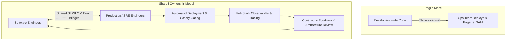

# 01. What is Production Engineering?

## 1. Problem
Traditional software engineering often treats deployment as the finish line: code is written, unit-tested, and tossed "over the wall" to operations teams. In distributed systems operating at scale, this boundary produces fragile services, prolonged outages, alert fatigue, and blind firefighting.

## 2. Production Context
At scale (millions of users, thousands of microservices, petabytes of state), systems are in a perpetual state of partial degradation: disks fail, network packets drop, GC cycles pause threads, and dependencies slow down. Production Engineering is the discipline of treating operations as a software problem.

## 3. Mental Model
$$\mathbf{Software\ Engineering} + \mathbf{Systems\ Engineering} + \mathbf{Operational\ Discipline} = \mathbf{Production\ Engineering}$$
Production engineers design systems that are self-healing, observable, resilient to partial failures, and simple to operate under stress.

## 4. System Diagram

## 5. Signals
- **Healthy Signals**: High release velocity with low change failure rate ($< 5\%$), high MTBF (Mean Time Between Failures), low toil ratio ($< 50\%$).
- **Degraded Signals**: Frequent Sev-1 outages, high MTTR ($> 1\text{ hr}$), on-call burnout, alert fatigue.

## 6. Failure Modes
- **Throw-Over-The-Wall Culture**: Feature developers unaware of runtime resource constraints or failure modes.
- **Manual Toil Trap**: Operational teams drowning in repetitive ticket-based manual interventions instead of writing automation.
- **Observability Black Holes**: Services running in production with zero distributed tracing or actionable health probes.

## 7. Detection
- Track the **DORA Metrics**: Deployment Frequency, Lead Time for Changes, Change Failure Rate, and Time to Restore Service.
- Measure **Toil Percentage**: Quantify hours spent on repetitive manual tasks vs engineering automation.

## 8. Diagnosis
When assessing an engineering organization's production maturity:
1. Are production alerts symptom-based or cause-based?
2. Is on-call shared between product developers and production engineers?
3. Are postmortems strictly blameless and backed by trackable action items?

## 9. Mitigation
- Establish Service Level Objectives (SLOs) and Error Budgets to create shared incentives between feature velocity and system stability.
- Institute Production Readiness Reviews (PRRs) before any service goes live.

## 10. Recovery
- Automate deployment rollbacks based on error rate spikes during canary evaluation.
- Implement automated self-healing mechanisms (e.g. automatic pod restarts, circuit breaker tripping).

## 11. Verification
- Verify that automated rollback triggers within 60 seconds of error budget burn spikes.
- Confirm distributed traces link from client edge through databases.

## 12. Prevention
- Enforce mandatory architectural reviews covering failure domains, rate limits, and fallback paths.
- Embed production engineers directly within product teams during early design phases.

## 13. Automation
- Automated CI/CD canary verification using Prometheus metrics evaluation.
- Automated runbook execution for common transient failures (e.g. clearing stale temp storage).

## 14. Performance
- Production engineering ensures performance testing (load, soak, spike) is part of continuous integration.
- Focuses on tail latency (p99/p99.9) rather than misleading averages.

## 15. Reliability
- Builds defense-in-depth: bulkheads, timeouts, retries with jitter, and adaptive load shedding.

## 16. Trade-offs
- **Feature Velocity vs. System Stability**: Error budgets provide the mathematical framework to balance rapid iteration with reliability guarantees.
- **Automation Complexity vs. Manual Control**: Automating complex failovers introduces the risk of automation bugs; requires strict guardrails.

## 17. Production Example
At fictional fintech *ApexPay*, payments would intermittently timeout on Cyber Monday. The product team blamed the database, while the DBA blamed network latency. A Production Engineer introduced distributed tracing (OpenTelemetry), which immediately proved that synchronous fraud detection HTTP calls were executing inside active database transactions, holding connection pool slots open for 4,000ms. Moving the fraud check outside the transaction reduced DB connection wait time by $98\%$ and eliminated checkout timeouts.

## 18. Interview Questions
- **Q1**: *What is the difference between SRE, Production Engineering, and traditional Systems Administration?*
- **Q2**: *How do you convince a product team to halt feature releases when reliability is degrading?*
- **Q3**: *What makes a service 'production ready' beyond passing unit and integration tests?*

## 19. Strong Interview Answer
> *"Production Engineering is the application of software engineering principles to operations and infrastructure. Unlike traditional operations—which focuses on reactive maintenance and manual interventions—Production Engineering focuses on building software systems that manage, scale, and heal themselves. We treat production as an active part of the software development lifecycle, utilizing SLOs and Error Budgets to objectively balance development velocity against system reliability."*

## 20. Hands-on Exercise
1. **Local Setup**: Run a local HTTP mock server inside Docker.
2. **Observe**: Inspect default request latency using `curl` with timing format output (`curl -w "@curl-format.txt"`).
3. **Failure Injection**: Inject 500ms network latency using Linux Traffic Control (`tc`) inside the container.
4. **Cleanup**: Reset `tc` network rules and verify latency returns to baseline ($< 2\text{ms}$).
