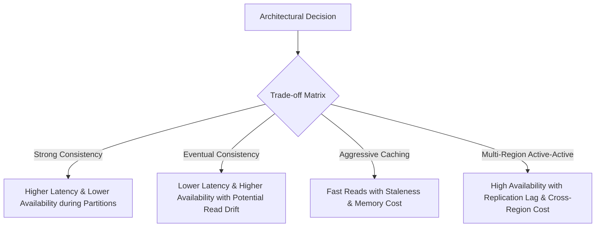

# 02. The 11 Reliability Dimensions and Engineering Trade-offs

## 1. Problem
Engineers often optimize single dimensions (e.g. maximizing throughput or minimizing latency) without recognizing that distributed systems are governed by fundamental trade-offs. Optimizing one dimension blindly degrades others, causing unexpected production outages.

## 2. Production Context
In cloud-native, distributed microservice environments, no system achieves $100\%$ availability, zero latency, infinite scalability, and strong consistency simultaneously. Production engineers must rigorously quantify and defend trade-offs.

## 3. Mental Model
$$\text{Reliability is not a single number; it is an 11-dimensional vector:}$$
$$\mathbf{R} = \langle \text{Availability}, \text{Latency}, \text{Throughput}, \text{Correctness}, \text{Durability}, \text{Capacity}, \text{Reliability}, \text{Recoverability}, \text{Operability}, \text{Security}, \text{Cost} \rangle$$

## 4. System Diagram

## 5. Signals
- High availability with silent data corruption (Availability prioritized over Correctness).
- High throughput with exploding tail latency (Throughput prioritized over Latency).
- Low infrastructure cost with zero failover headroom (Cost prioritized over Recoverability).

## 6. Failure Modes
- **The Consistency Sacrifice**: Reading stale data from un-synced read replicas leading to financial balance errors.
- **The Latency Trap**: Synchronous cross-region 2-phase commits causing 500ms API response times.
- **The False Durability Failure**: Acknowledging writes in RAM before fsyncing WAL to persistent disk, losing committed data during power loss.

## 7. Detection
- Compare business correctness audits against read-replica latency.
- Measure p50 vs p99.9 latency under network degradation.

## 8. Diagnosis
1. Map the system's exact consistency model (Linearizable, Sequential, Causal, Eventual).
2. Measure database write acknowledgment levels (`acks=all` vs `acks=1` in Kafka; `fsync=always` vs `fsync=everysec`).

## 9. Mitigation
- Partition critical financial flows to strong consistency (ACID / Paxos) and non-critical flows to eventual consistency.
- Implement read-your-own-writes session consistency for user actions.

## 10. Recovery
- Automated reconciliation jobs to heal eventual consistency drift.
- Replaying dead-letter queues to restore corrupted or dropped state.

## 11. Verification
- Chaos experiments verifying data durability after abrupt container SIGKILL.
- Load testing measuring latency degradation when 1 availability zone is severed.

## 12. Prevention
- Document explicit SLOs for each dimension in architectural RFCs before coding.

## 13. Automation
- Automated daily cross-database reconciliation checks.
- Continuous chaos testing injecting network latency into read-replica replication streams.

## 14. Performance
- Throughput and latency exist in tension: batching increases throughput but penalizes per-request latency.

## 15. Reliability
- High availability ($99.99\%$) requires automated failover, redundant quorum nodes, and active-active routing.

## 16. Trade-offs
| Dimension A | Dimension B | The Core Architectural Trade-off |
| :--- | :--- | :--- |
| **Availability** | **Consistency** | CAP Theorem: Under network partition, choose between returning an error or returning stale data. |
| **Latency** | **Durability** | Writing to disk (`fsync`) and waiting for multi-node quorums increases write latency. |
| **Throughput** | **Latency** | Slicing requests into micro-batches improves network efficiency but delays single-item processing. |
| **Cost** | **Recoverability** | Multi-region active-active warm standby doubles cloud infrastructure spending. |

## 17. Production Example
At fictional streaming service *PulseStream*, video view counts are updated using an eventual consistency model with in-memory Redis buffers (optimizing Throughput and Latency over Immediate Correctness). However, user subscription billing uses strict PostgreSQL serializable transactions (optimizing Correctness and Durability over Latency). Choosing the right trade-off per domain prevented billing corruption while supporting 500,000 video views per second.

## 18. Interview Questions
- **Q1**: *How do you choose between strong consistency and eventual consistency in a distributed shopping cart?*
- **Q2**: *Why does increasing batch size improve throughput but harm tail latency?*
- **Q3**: *If your service has a 99.95% availability SLO, how many minutes of downtime are you allowed per month?*

## 19. Strong Interview Answer
> *"Reliability is not a monolithic boolean state—it is a calibrated set of trade-offs across availability, latency, correctness, durability, and cost. In distributed systems design, every choice comes with a cost: enforcing strong linearizable consistency requires multi-node consensus round-trips that penalize write latency and reduce availability during partitions. As a Production Engineer, I explicitly decouple domains: user-facing analytics can tolerate eventual consistency to achieve sub-10ms latency, while financial ledger transactions must enforce strict durability and linearizable correctness regardless of the latency cost."*

## 20. Hands-on Exercise
1. **Setup**: Run a local 3-node Redis cluster in Docker.
2. **Experiment**: Write keys with asynchronous replication and immediately kill the primary node before replication completes.
3. **Observe**: Read from the promoted replica and observe the lost write (demonstrating the Latency vs Durability trade-off).
4. **Cleanup**: Restart the original primary and tear down the Docker cluster.
