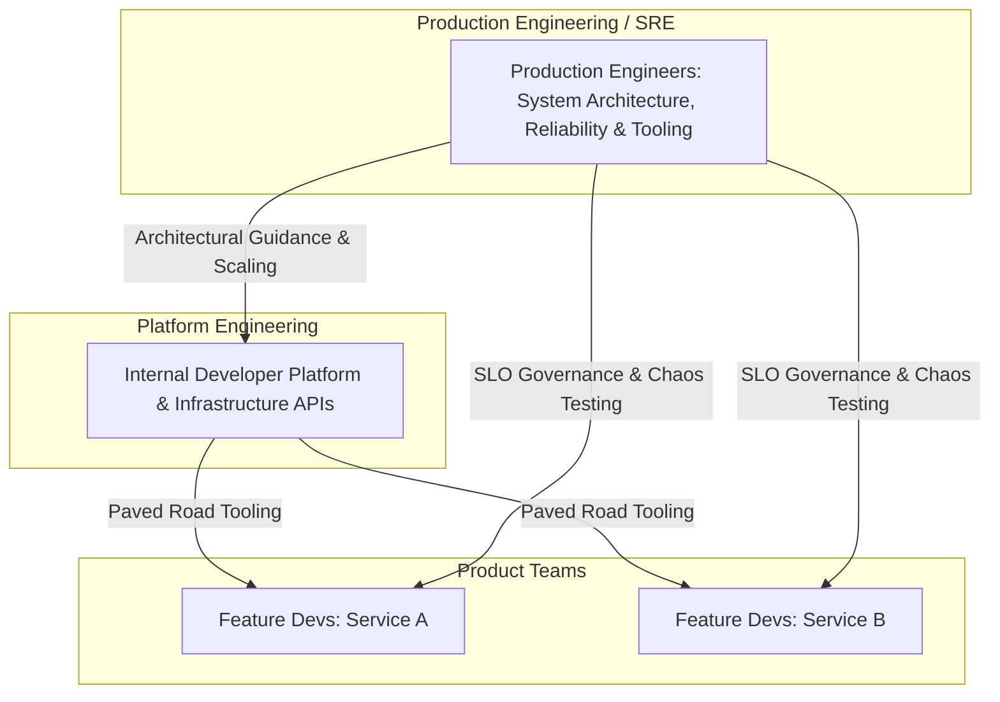

# 03. Production Engineering vs. SRE vs. DevOps vs. Platform Engineering

## 1. Problem
Organizations often use terms like "SRE", "DevOps", "Production Engineering", and "Platform Engineering" interchangeably, leading to confused responsibilities, misaligned incentives, and broken on-call rotations.

## 2. Production Context
Different engineering organizations adopt distinct operational models depending on scale, regulatory requirements, and technical complexity. Understanding these archetypes is crucial for Senior/Staff interview rounds.

## 3. Mental Model
$$\begin{aligned}
\mathbf{DevOps} &\implies \text{Cultural movement uniting Dev and Ops via CI/CD and automation} \\
\mathbf{SRE} &\implies \text{Class implementing DevOps using software engineering practices (Google model)} \\
\mathbf{Production\ Eng} &\implies \text{Engineering focused on system architecture, reliability, scale, and runtime internals (Meta/Stripe model)} \\
\mathbf{Platform\ Eng} &\implies \text{Building Internal Developer Platforms (IDPs) to provide paved roads for feature developers}
\end{aligned}$$

## 4. System Diagram

## 5. Signals
- **Healthy Organization**: Developers deploy safely using automated paved roads; SREs/PEs spend $>50\%$ of time on engineering projects; toil is actively capped.
- **Unhealthy Organization**: SREs acting as manual gatekeepers or ticket-pushing "glorified sysadmins"; feature developers disconnected from production behavior.

## 6. Failure Modes
- **The SRE Silo**: SRE team becomes an isolated firefighting island with zero authority to block unstable releases.
- **The Pseudo-DevOps Model**: Developers given direct access to production infrastructure with zero guardrails, leading to misconfigured security groups and outages.
- **The Toil Spiral**: Operational tasks scale linearly with traffic, leaving zero engineering time for automation.

## 7. Detection
- Audit time-tracking: If on-call/SRE engineers spend $>50\%$ of time on manual operations, the team is trapped in toil.
- Check release ownership: If developers cannot deploy their own services to staging/canary, the platform is broken.

## 8. Diagnosis
1. Who owns the pager when an incident occurs?
2. What happens when an error budget is exhausted? (Is deployment paused, or ignored?)
3. Is infrastructure provisioned via code (GitOps) or manual web consoles?

## 9. Mitigation
- Enforce the **50% Toil Rule**: Cap operational overhead at $50\%$; redirect remaining time to automation software.
- Institute **Error Budget Policies**: When a service burns its monthly error budget, non-critical feature deployments halt until reliability work is completed.

## 10. Recovery
- Transition legacy manual runbooks into executable CLI scripts and Kubernetes operators.
- Introduce self-service paved roads via Platform Engineering tooling.

## 11. Verification
- Measure reduction in manual JIRA operational tickets over 90 days.
- Verify that developers can deploy a canary build within 15 minutes of merging code.

## 12. Prevention
- Include reliability, operability, and observability requirements in initial engineering design RFCs.

## 13. Automation
- Automated infrastructure provisioning via Terraform and GitOps controllers (ArgoCD / Flux).
- Automated remediation pipelines for common alert patterns.

## 14. Performance
- Paved roads standardize optimized container base images, JVM flags, and connection pool configs across all microservices.

## 15. Reliability
- Standardized platform templates enforce multi-AZ deployment, health probes, and graceful shutdown out of the box.

## 16. Trade-offs
| Operating Model | Key Advantage | Primary Risk / Challenge |
| :--- | :--- | :--- |
| **Embedded SRE** | Deep domain context with product team | SREs can be pressured to accept technical debt or manual toil |
| **Centralized SRE** | Strong architectural consistency across org | Can become detached from specific application nuances |
| **Platform Engineering** | High self-service developer velocity | Risk of building platforms that don't fit specific product workflows |

## 17. Production Example
At fictional e-commerce platform *CartNova*, the operations team spent 20 hours a week manually resizing database clusters and clearing disk space. A Production Engineering initiative built an automated DB storage autoscaler and an integrated Prometheus alert-manager webhook that automatically pruned dead WAL files. This reduced operational toil by $90\%$, freeing the engineers to design an active-active multi-region failover pipeline.

## 18. Interview Questions
- **Q1**: *How do you define toil, and how does SRE mathematically bound it?*
- **Q2**: *What is an Error Budget, and what concrete actions should occur when a team burns 100% of it?*
- **Q3**: *How does Platform Engineering complement Site Reliability Engineering in modern tech companies?*

## 19. Strong Interview Answer
> *"SRE and Production Engineering are software-centric approaches to infrastructure and operations. The defining difference from traditional IT operations is the programmatic approach to reliability: we treat infrastructure as code, quantify user satisfaction through SLIs and SLOs, and use Error Budgets as an objective governance tool. If a service burns its error budget, development shifts from feature velocity to reliability hardening. Furthermore, we enforce Google's 50% rule: at least half of an engineer's time must be dedicated to writing software and automation that eliminates repetitive operational toil."*

## 20. Hands-on Exercise
1. **Setup**: Inspect a sample GitHub Actions / GitLab CI pipeline.
2. **Experiment**: Add a pre-deployment step that queries Prometheus to verify that current production error rate is $< 0.1\%$ before initiating a canary deploy.
3. **Verify**: Test by simulating a failing metric check and observing the deployment halt automatically.
