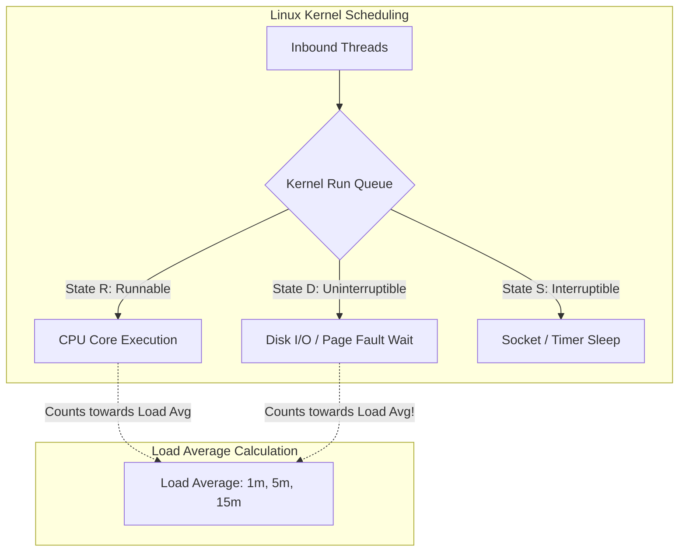

# 01. Reading a Stressed Linux System

## 1. Problem
When a production server experiences a latency spike, engineers often jump between random commands without a coherent mental model, misinterpreting high Load Average or blaming CPU when the real bottleneck is disk I/O wait or lock contention.

## 2. Production Context
A Linux host orchestrates CPU cores, RAM pages, disk blocks, and network sockets across hundreds of containerized tasks. Misinterpreting kernel metrics leads to wrong mitigations (e.g. scaling CPU cores when the disk controller is saturated).

## 3. Mental Model
$$\mathbf{Load\ Average} = \text{Running Processes (Task State R)} + \text{Uninterruptible Sleep Processes (Task State D)}$$
- **State R (Running/Runnable)**: Threads actively executing on a CPU or waiting in the kernel run queue.
- **State D (Disk/Uninterruptible Sleep)**: Threads blocked on synchronous disk I/O, NFS locks, or kernel page-in.
- **Rule of Thumb**: A 4-core machine with Load Average $= 4.0$ is at $100\%$ capacity. If Load Average $= 20.0$ and CPU utilization is only $10\%$, processes are starved on **disk I/O wait (State D)**, not CPU!

## 4. System Diagram

## 5. Signals
- **CPU Bound**: High `%usr` (application compute) or high `%sys` (kernel system calls/context switches).
- **I/O Bound**: High `%wa` (iowait) in `top` / `vmstat`, high `b` column (blocked processes) in `vmstat`.
- **Memory Starvation**: High `si` (swap-in) and `so` (swap-out) in `vmstat`, rising `/proc/pressure/memory`.

## 6. Failure Modes
- **I/O Starvation Spiral**: A slow disk write blocks thread 1 in State D; thread 2 queues behind thread 1; run queue explodes, inflating Load Average to 150.
- **Context Switch Thrashing**: Thousands of threads competing for 8 CPU cores, spending $40\%$ of CPU time on kernel context switches (`%sys`) rather than user code (`%usr`).

## 7. Detection
- Run `uptime` to inspect 1-minute, 5-minute, and 15-minute load averages.
- Run `vmstat 1 5` to inspect `r` (runnable), `b` (blocked on I/O), `us`, `sy`, and `wa`.

## 8. Diagnosis
1. Check CPU vs I/O breakdown: `vmstat 1 3`.
2. If `b > 0` and `wa > 20%`: Disk is bottleneck $\implies$ Run `iostat -xz 1 3`.
3. If `r > (cores * 2)` and `us + sy > 90%`: CPU saturated $\implies$ Run `pidstat -u 1 3`.

## 9. Mitigation
- For I/O saturation: Move logging to asynchronous RAM buffers; isolate database write disks.
- For CPU saturation: Rate limit inbound requests; scale pods horizontally.

## 10. Recovery
- Drain traffic from saturated node in load balancer pool.
- Terminate rogue spinning processes (`kill -15 <pid>` or `kill -9 <pid>`).

## 11. Verification
- Confirm `vmstat 1 3` shows `r < cores` and `b = 0`.
- Verify `/proc/loadavg` decays towards normal baseline ($< \text{core count}$).

## 12. Prevention
- Set strict CPU and memory limits (`cgroups v2` / Kubernetes resource limits) on all workloads.
- Use asynchronous non-blocking I/O (epoll / io_uring) to avoid State D thread blocking.

## 13. Automation
- Automated node eviction when Linux PSI (`/proc/pressure/cpu` or `memory`) breaches $60\%$ stall time for $>30$ seconds.

## 14. Performance
- Efficient Linux kernels maintain low `%sys` ($< 15\%$) and negligible `%wa` ($< 2\%$).

## 15. Reliability
- Isolating application storage on dedicated NVMe partitions prevents system logging from freezing the OS root filesystem.

## 16. Trade-offs
- **Synchronous vs Asynchronous Disk I/O**: `fsync()` guarantees durability but stalls threads in State D; async writes risk data loss on power failure.

## 17. Production Example
At fictional analytics company *MetricBase*, an Elasticsearch cluster became unresponsive during nightly batch indexing. Load average spiked to 85 on 16-core servers. The on-call engineer initially assumed CPU starvation and attempted to scale CPU cores. A production engineer ran `vmstat 1` and noticed `r=2`, `b=45`, and `wa=78%`—proving the CPU was mostly idle while 45 worker threads were locked in State D waiting for slow HDD rotational disks to flush Lucene segment merges. Upgrading the storage to NVMe SSDs reduced disk latency by $95\%$ and load average dropped from 85 to 3.2.

## 18. Interview Questions
- **Q1**: *Why does Linux include processes in State D (Uninterruptible Sleep) in the Load Average calculation?*
- **Q2**: *If a 4-core machine has a Load Average of 25.0 but CPU utilization is only 8%, what is the bottleneck?*
- **Q3**: *What is the difference between %usr, %sys, %wa, and %st in CPU metrics?*

## 19. Strong Interview Answer
> *"Load Average in Linux represents the average demand for system resources over 1, 5, and 15 minutes. Unlike other Unix systems that only count runnable processes (State R), Linux intentionally counts processes in Uninterruptible Sleep (State D) as well. A process in State D is typically blocked on synchronous disk I/O or page faulting. Therefore, a high Load Average with low CPU percentage is the classic diagnostic signature of storage I/O saturation or disk controller bottlenecking—not CPU exhaustion."*

## 20. Hands-on Exercise
1. **Setup**: In a Linux terminal, inspect `/proc/loadavg`.
2. **Experiment**: Simulate CPU load using `stress-ng --cpu 4 --timeout 30s` (adjust to core count).
3. **Observe**: Run `vmstat 1` and watch column `r` rise to 4 and `%usr` reach 100%.
4. **Cleanup**: Wait for timeout and verify `vmstat` returns to idle state.
