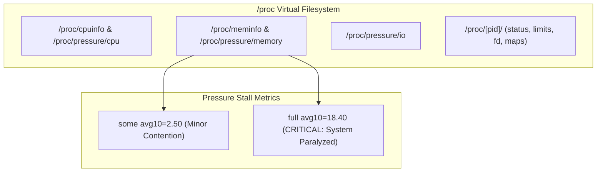

# 02. The `/proc` Filesystem and Pressure Stall Information (PSI)

## 1. Problem
Traditional utilization metrics (e.g. `% CPU used` or `% Memory used`) do not indicate whether a system is actually *starving* for resources. High memory utilization is normal in Linux due to the Page Cache; what matters is whether processes are stalled waiting for memory reclaim or CPU cycles.

## 2. Production Context
Modern Linux kernels (5.x, 6.x) and cgroups v2 introduce **Pressure Stall Information (PSI)** to provide precise, real-time metrics on resource starvation across CPU, Memory, and I/O.

## 3. Mental Model
$$\text{PSI measures the percentage of wall-clock time that tasks are stalled waiting for resources:}$$
- **`some`**: At least one task was delayed waiting for the resource (e.g. waiting for page reclaim or disk I/O).
- **`full`**: **ALL non-idle tasks** were stalled simultaneously (complete system lockup / throughput drops to zero).

## 4. System Diagram


## 5. Signals
- Healthy PSI: `some avg10=0.00`, `full avg10=0.00`.
- Memory Thrashing: `memory some avg10 > 20.00`, `memory full avg10 > 5.00`.
- CPU Starvation: `cpu some avg10 > 30.00`.

## 6. Failure Modes
- **Memory Thrashing Spiral**: Heavy memory pressure forces the kernel to continually evict and re-read page cache files, driving `memory full` stall time to $80\%$.
- **Cgroup Throttling Stalls**: Container CPU limit set too low; kernel throttles threads, inflating `cpu some` stall metrics.

## 7. Detection
```bash
# Read real-time Pressure Stall Information
cat /proc/pressure/cpu
cat /proc/pressure/memory
cat /proc/pressure/io
```
Example Output:
```
some avg10=14.20 avg60=8.10 avg300=4.50 total=18492040
full avg10=6.40  avg60=3.20 avg300=1.10 total=4820100
```

## 8. Diagnosis
1. Inspect `/proc/meminfo`: Check `MemAvailable` vs `MemTotal` (do NOT look at `MemFree` alone, which excludes reclaimable Page Cache!).
2. Inspect `/proc/[pid]/status`: Check `VmRSS` (physical RAM) and `Threads`.
3. Inspect `/proc/[pid]/limits`: Check `Max open files` (RLIMIT_NOFILE).

## 9. Mitigation
- For high memory PSI: Evict non-essential container workloads or expand container memory request/limits.
- For high CPU PSI: Increase CPU quotas in Kubernetes pod spec.

## 10. Recovery
- OOM daemon (systemd-oomd) or Kubernetes kubelet will evict low-priority pods based on PSI thresholds before the entire node crashes.

## 11. Verification
- Confirm `/proc/pressure/memory` returns to `avg10=0.00`.
- Verify `MemAvailable` in `/proc/meminfo` is $>20\%$ of total RAM.

## 12. Prevention
- Configure alerts on `node_pressure_memory_waiting_seconds_total` and `node_pressure_cpu_waiting_seconds_total` in Prometheus.

## 13. Automation
- Automated autoscaling (KEDA) scaling pods based on container PSI metrics rather than raw CPU utilization percentages.

## 14. Performance
- PSI calculations are computed directly inside kernel task schedulers with $< 0.1\%$ CPU overhead.

## 15. Reliability
- PSI gives early warning signals minutes before catastrophic Linux OOM-killer invocations.

## 16. Trade-offs
- **Raw CPU% vs PSI**: Raw CPU% reaches $100\%$ even on well-running compute tasks; PSI only alerts when tasks are actively delayed or throttled.

## 17. Production Example
At fictional trading platform *ApexQuant*, worker nodes occasionally suffered 10-second request spikes. Traditional CPU monitoring showed 65% utilization (considered healthy). An SRE queried `/proc/pressure/io` and discovered `some avg10=42.00`—revealing that the OS was stalled 42% of the time waiting for synchronous log flushing to an encrypted EBS volume. Migrating logs to a local ephemeral NVMe disk reduced I/O pressure stall time to $0.00\%$ and eliminated p99 latency spikes.

## 18. Interview Questions
- **Q1**: *Why is `MemAvailable` in `/proc/meminfo` a better indicator of memory health than `MemFree`?*
- **Q2**: *What is the difference between `some` and `full` in Linux Pressure Stall Information?*
- **Q3**: *How do you inspect the maximum file descriptor limit of a running process without restarting it?*

## 19. Strong Interview Answer
> *"In Linux, free memory is wasted memory: the kernel automatically allocates unused RAM to the Page Cache to accelerate disk reads. Therefore, `MemFree` is almost always low on a busy server. The true metric to watch is `MemAvailable` in `/proc/meminfo`, which calculates free memory plus reclaimable page cache and dentries/inodes that the kernel can free immediately without swapping. Furthermore, modern SRE teams rely on Pressure Stall Information (PSI) at `/proc/pressure/memory`: `some` indicates when tasks are delayed waiting for memory reclaim, while `full` indicates the critical state where all active threads are completely paralyzed."*

## 20. Hands-on Exercise
1. **Setup**: In a terminal, run `cat /proc/meminfo | head -n 10`.
2. **Observe**: Note the difference between `MemFree`, `MemAvailable`, `Buffers`, and `Cached`.
3. **Inspect Process Limits**: Find the PID of your current shell (`echo $$`) and view its limits: `cat /proc/$$/limits | grep "open files"`.
