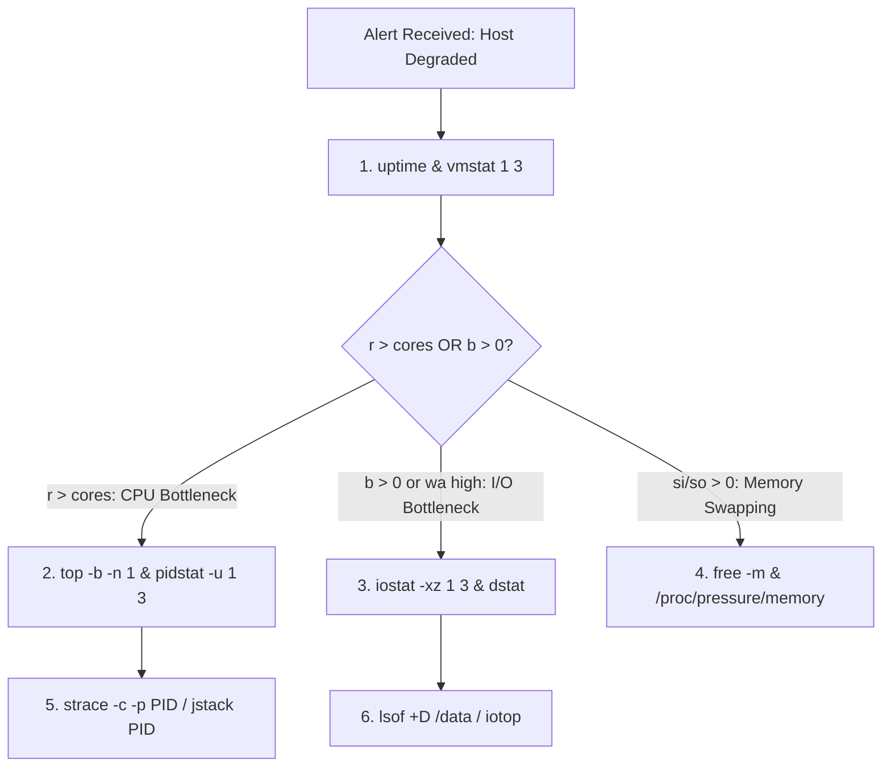

# 03. The Production Linux CLI Triage Toolchain

## 1. Problem
Under high-pressure outages, engineers frequently memorize CLI syntax rather than understanding which tool answers which specific production question.

## 2. Production Context
A production engineer logged into an SSH terminal or debugging sidecar must systematically isolate host bottlenecks across CPU, Memory, Disk, and Network within 60 seconds.

## 3. Mental Model: The Production Question Matrix
Every Linux command must map to an exact diagnostic question:

| Command | The Production Question It Answers | Key Columns to Watch |
| :--- | :--- | :--- |
| `uptime` | *Is load increasing or decaying? Is the system overwhelmed?* | 1m, 5m, 15m load averages |
| `top` / `htop` | *Which process is consuming CPU or physical RAM?* | `%CPU`, `RES` (Resident RAM), `SHR`, `COMMAND` |
| `ps aux --sort=-%mem` | *What are the top 10 memory-consuming processes?* | `RSS`, `VSZ`, `STAT` (D, R, S, Z) |
| `free -m` | *Do we have enough available RAM? Is swap active?* | `available`, `swap used` |
| `vmstat 1 5` | *Is the bottleneck CPU run queue, blocked I/O, or swap?* | `r` (run queue), `b` (blocked I/O), `si/so`, `wa` |
| `iostat -xz 1 3` | *Which physical disk is saturated? What is the queue depth?* | `r/s`, `w/s`, `r_await`, `w_await`, `%util` |
| `df -h` & `df -i` | *Is the filesystem full of bytes or exhausted of inodes?* | `Use%`, `IUse%` |
| `ss -s` & `ss -tulpn` | *Are TCP sockets stuck in TIME_WAIT or LISTEN queue overflowing?* | `SYN-RECV`, `TIME-WAIT`, `Recv-Q`, `Send-Q` |
| `lsof -p <pid> \| wc -l`| *Is this process leaking file descriptors or socket handles?* | File descriptor count vs `RLIMIT_NOFILE` |
| `sar -n DEV 1 3` | *Is the network interface dropping packets or saturating bandwidth?* | `rxpck/s`, `txpck/s`, `rxdrop/s`, `txdrop/s` |
| `strace -c -p <pid>` | *What system calls is this slow process spending time in?* | `% time`, `seconds`, `syscall` (futex, epoll, read) |
| `journalctl -xeu <svc>`| *Did systemd terminate the service? Any kernel panic or segfault?* | Kernel log messages, SIGSEGV, Out of Memory |

---

## 4. System Diagram: The 60-Second Triage Flowchart


---

## 5. System Call Tracing with `strace`
```bash
# 1. Summarize system call time distribution of a hanging process
strace -c -p 4120
# Output shows if process is stuck in futex() (lock contention) or read() (socket wait)

# 2. Trace specific file opens and network connects with timestamps
strace -t -e trace=openat,connect -p 4120
```

---

## 6. Socket Queue Triage with `ss`
```bash
# Check if service listen backlog is overflowing
ss -lnt '( sport = :8080 )'
# If Recv-Q > Send-Q, the application thread pool is failing to accept new connections!
```

---

## 7. Interview Questions & Model Answers

**Q1: How do you tell if a disk is 100% saturated using `iostat`?**
**Answer**: Look at `%util` and `await`. In `iostat -xz 1 3`, `%util` close to $100\%$ indicates the disk device is handling requests full-time. However, on multi-queue NVMe SSDs capable of parallel I/O, `%util` can be high while still accepting load. Therefore, correlate `%util` with `r_await` / `w_await` (average latency per I/O in milliseconds) and `aqu-sz` (average queue size). If latency spikes from 0.5ms to $>20\text{ms}$ with high queue size, the storage layer is saturated.

**Q2: What is the difference between `df -h` and `df -i`?**
**Answer**: `df -h` reports disk space in terms of consumed bytes/blocks. `df -i` reports the consumption of filesystem **inodes** (data structures storing file metadata). If an application creates millions of zero-byte temporary files, `df -h` will show 99% free space while `df -i` shows 100% inode exhaustion, causing `No space left on device` errors on subsequent write attempts.
