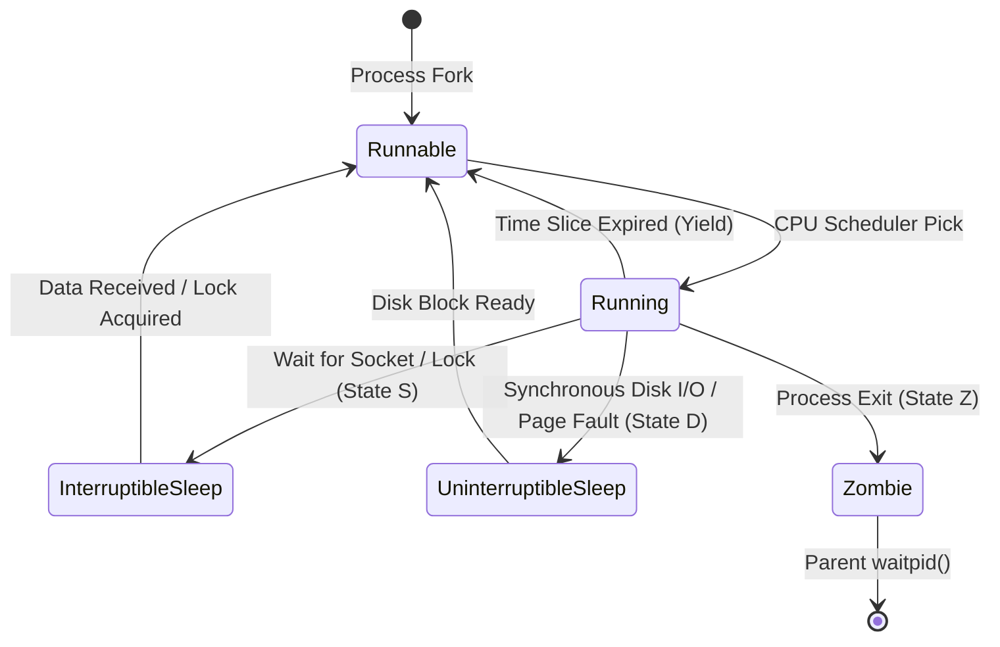

# 01. Linux Process States, Thread Pools, and Context Switching

## 1. Problem
When a multi-threaded service becomes unresponsive, developers often increase the thread pool size (e.g. from 200 to 2,000 threads). This exacerbates CPU context switching, saturates memory with thread stack allocations, and leads to thread pool starvation.

## 2. Production Context
In high-throughput services, threads spend time in various Linux task states. Understanding whether threads are waiting on lock synchronizers, blocked on socket reads, or actively executing is critical for diagnosing latency regressions.

## 3. Mental Model
$$\text{Linux Task States (displayed in } \texttt{ps / top}\text{):}$$
- **`R` (Running / Runnable)**: Actively computing on CPU or queued in kernel run queue.
- **`S` (Interruptible Sleep)**: Waiting on an event (timer, network socket, queue poll).
- **`D` (Uninterruptible Sleep)**: Blocked in kernel space on hardware I/O or page fault.
- **`Z` (Zombie)**: Terminated process whose parent has not yet read its exit code via `waitpid()`.
- **`T` (Stopped)**: Paused by debugger or SIGSTOP.

## 4. System Diagram


## 5. Signals
- **Thread Starvation**: Inbound request queue depth growing; API returning HTTP 503 or connection timeout.
- **Context Switch Saturation**: `vmstat 1` showing `cs` (context switches) $> 100,000/\text{sec}$ with `%sys` CPU $> 30\%$.
- **Zombie Proliferation**: Hundreds of `[defunct]` processes accumulating in `ps aux`.

## 6. Failure Modes
- **The Thread Pool Expansion Trap**: Increasing Tomcat/Jetty thread pool to 2,000 threads; when a downstream dependency slows down, all 2,000 threads block, consuming 2GB of RAM (1MB stack per thread) and thrashing the OS scheduler.
- **Zombie Leakage**: A parent process fails to reap child worker processes, eventually exhausting the OS PID namespace (`/proc/sys/kernel/pid_max`).

## 7. Detection
```bash
# 1. Count process threads by state
ps -eLo state | sort | uniq -c

# 2. Measure context switches per second
vmstat 1 3

# 3. Inspect per-process voluntary vs involuntary context switches
pidstat -w -p <pid> 1 3
```

## 8. Diagnosis
- **Voluntary Context Switches (`cswch/s`)**: Process voluntarily yields CPU because it is blocked on I/O, sleep, or lock contention.
- **Involuntary Context Switches (`nvcswch/s`)**: Kernel pre-empts process because its CPU time slice expired; high value indicates too many active threads competing for too few CPU cores.

## 9. Mitigation
- Size thread pools to realistic core capacities:
  $$\text{Optimal Thread Count} = \text{CPU Cores} \times \left(1 + \frac{\text{Wait Time}}{\text{Compute Time}}\right)$$
- Switch to virtual threads (Java 21 Project Loom) or non-blocking async runtimes (Netty / Tokio) for high-concurrency I/O.

## 10. Recovery
- Capture thread dump (`jcmd <pid> Thread.print` or `jstack <pid>`) before restarting the JVM.
- Drain traffic from the saturated node in the load balancer pool.

## 11. Verification
- Verify thread count returns below pool maximum threshold.
- Confirm context switch rate (`cs`) drops to $< 20,000/\text{sec}$.

## 12. Prevention
- Enforce strict timeouts on all outbound HTTP/database client calls to prevent thread hoarding.
- Configure queue capacity limits with fast-fail rejection policies (`AbortPolicy` / `DiscardPolicy`).

## 13. Automation
- Automated health check probes rejecting traffic when thread pool queue utilization exceeds $80\%$.

## 14. Performance
- Context switching incurs CPU cache misses (L1/L2/L3 cache invalidation) and TLB flushes.

## 15. Reliability
- Isolating critical administrative endpoints on a dedicated thread pool ensures diagnostics remain accessible when the main worker pool is exhausted.

## 16. Trade-offs
- **Fixed Thread Pool vs Cached Thread Pool**: Fixed pools provide predictable memory limits but reject bursts; cached unbounded pools absorb bursts but risk OOM kills under prolonged overload.

## 17. Production Example
At fictional ride-hailing app *SpeedyRide*, the dispatch service experienced latency spikes during rush hour. CPU utilization was 45%, but p99 latency jumped from 20ms to 4,000ms. An SRE inspected `pidstat -w` and discovered the service was executing 250,000 involuntary context switches per second across 1,500 worker threads. Downsizing the worker pool to 64 threads (matching host CPU cores $\times 4$) eliminated scheduling thrashing, reducing p99 latency to 18ms under the same traffic load.

## 18. Interview Questions
- **Q1**: *What is the physical cost of an involuntary context switch in the Linux kernel?*
- **Q2**: *How do you diagnose why a service is unresponsive when CPU utilization is only 10%?*
- **Q3**: *Why does creating thousands of OS threads lead to performance degradation?*

## 19. Strong Interview Answer
> *"When tuning thread pools in high-scale services, more threads do not equal more throughput. Each OS thread requires stack memory allocation (typically 1MB) and incurs scheduling overhead. When hundreds of threads compete for CPU cores, the kernel scheduler spends significant CPU time performing involuntary context switches—saving CPU register states, invalidating L1/L2 hardware caches, and flushing TLB translation buffers. The golden rule for I/O-heavy services is to size thread pools based on the ratio of compute time to wait time, enforce strict timeouts on all downstream calls, or leverage lightweight user-space virtual threads."*

## 20. Hands-on Exercise
1. **Setup**: Run `pidstat -w 1 3` to observe your current system context switch rate.
2. **Experiment**: Spawn 500 competing background bash subshells: `for i in {1..500}; do (while true; do :; done &); done`.
3. **Observe**: Run `vmstat 1` and watch `cs` and `%sys` jump drastically.
4. **Cleanup**: Kill the background processes: `killall bash` or terminate the subshells.
