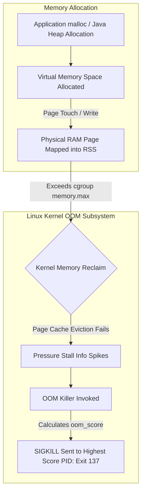

# 02. Memory Leaks and the Linux OOM Killer

## 1. Problem
An application memory footprint grows monotonically over days until the Linux kernel abruptly terminates the process via the **Out-of-Memory (OOM) Killer** (`Exit Code 137` / `SIGKILL`), causing severe customer outages without generating application-level stack traces.

## 2. Production Context
Memory in Linux consists of Virtual Memory (`VSZ`), Resident Set Size (`RSS`), Shared Memory, and Kernel Page Cache. In containerized environments (Docker / Kubernetes), the Linux cgroup memory limit enforces strict memory caps.

## 3. Mental Model
$$\mathbf{Virtual\ Memory\ (VSZ)} \ge \mathbf{Resident\ Memory\ (RSS)} = \text{Anonymous Memory} + \text{File Mappings}$$
- **Virtual Memory (`VSZ`)**: Address space allocated by `malloc()` / `mmap()`, not necessarily backed by physical RAM pages.
- **Resident Set Size (`RSS`)**: Physical RAM pages currently mapped into the process's page table.
- **Linux OOM Score**: When physical RAM + Swap (or cgroup limit) is exhausted, the kernel calculates an `oom_score` for each process and terminates the highest-scoring candidate.
  $$\text{oom\_score} \propto \frac{\text{process RSS}}{\text{total RAM}} \times 1000 + \text{oom\_score\_adj}$$

## 4. System Diagram


## 5. Signals
- **Memory Monotonic Growth**: `container_memory_working_set_bytes` steadily climbing with zero reclamation after GC cycles.
- **Kernel Log Signature**: `dmesg -T` showing:
  `Out of memory: Kill process 4120 (java) score 950 or sacrifice child`.
- **Kubernetes Exit Code 137**: Pod status `OOMKilled` (`128 + SIGKILL (9) = 137`).

## 6. Failure Modes
- **JVM Metaspace / Native Memory Leak**: Unbounded classloading, Netty direct byte buffer leaks (`UnpooledByteBufAllocator`), or JNI leaks invisible to Java Heap monitoring tools.
- **Static Collection Leak**: Appending items to a static `ConcurrentHashMap` without eviction or TTL policies.

## 7. Detection
```bash
# 1. Check kernel dmesg for OOM kill events
dmesg -T | grep -E -i "oom|killed process"

# 2. Inspect process memory breakdown in /proc
cat /proc/<pid>/status | grep -E "VmRSS|VmHWM|VmSize|RssAnon|RssFile"

# 3. View OOM score and adjustment factor
cat /proc/<pid>/oom_score
cat /proc/<pid>/oom_score_adj
```

## 8. Diagnosis (Evidence-First Protocol)
1. **Never restart immediately without diagnostics**: Configure JVM flags for automatic heap dumps on OOM:
   `-XX:+HeapDumpOnOutOfMemoryError -XX:HeapDumpPath=/data/dumps/oom.hprof`
2. If Java Heap is normal but container is OOMKilled: The leak is in **Native Memory** $\implies$ Enable Native Memory Tracking:
   `-XX:NativeMemoryTracking=detail` and query `jcmd <pid> VM.native_memory baseline / detail.diff`.

## 9. Mitigation
- Temporarily increase container memory limit in deployment spec.
- Protect critical system daemons from OOM killer:
  `echo -1000 > /proc/<sshd_pid>/oom_score_adj` (Prevents SSH daemon from being killed during OOM).

## 10. Recovery
- Re-deploy service with memory leak patch.
- Analyze captured `.hprof` heap dump using Eclipse Memory Analyzer (MAT) or `jhat` to find the leaking GC Root.

## 11. Verification
- Monitor memory slope over 48 hours post-deployment: memory should stabilize at a steady plateau after warmup.

## 12. Prevention
- Use bounded caches (`Caffeine` / `Guava`) with maximum weight and time-based eviction.
- Set explicit max limits on direct memory buffers (`-XX:MaxDirectMemorySize=512m`).

## 13. Automation
- Automated CI regression tests executing 4-hour soak tests measuring heap retention before merging pull requests.

## 14. Performance
- Sizing JVM heap to $>80\%$ of container RAM triggers kernel OOM kills because JVM off-heap allocations (thread stacks, code cache, direct buffers) exceed the remaining 20%.

## 15. Reliability
- Standard Rule: **Container Memory Limit $\ge$ JVM Heap ($\text{Xmx}$) $+ 25\%$ (for off-heap and native buffers)**.

## 16. Trade-offs
- **Heap Dump on OOM vs Fail-Fast Restart**: Capturing a 16GB heap dump pauses the JVM for 15–30 seconds before killing; necessary for root cause analysis, but delays pod recreation.

## 17. Production Example
At fictional logistics unicorn *ShipFast*, the tracking ingestion service was OOMKilled every 18 hours. The team increased container RAM from 4GB to 8GB, but the pod simply took 36 hours to be OOMKilled. An SRE enabled Java Native Memory Tracking (`NMT`) and analyzed the diff using `jcmd`. The report showed that unclosed Netty HTTP client response bodies in an analytics SDK were leaking Direct Byte Buffers into off-heap memory at 2MB per minute. Adding a `try-with-resources` block to release the buffers stabilized native memory at 240MB indefinitely.

## 18. Interview Questions
- **Q1**: *What is the difference between an application-level OutOfMemoryError and a Linux kernel OOM Kill (Exit Code 137)?*
- **Q2**: *How does the Linux kernel choose which process to terminate when memory is exhausted?*
- **Q3**: *Why might a Java container with `-Xmx4g` be OOMKilled in a container with a 4GB memory limit?*

## 19. Strong Interview Answer
> *"An application-level `java.lang.OutOfMemoryError` is thrown by the JVM when the Java Heap cannot allocate an object despite running full GC cycles; the process remains running unless configured otherwise. In contrast, an OOM Kill (Exit Code 137) is an abrupt kernel-level `SIGKILL` executed by the Linux OOM Killer when total physical RAM plus swap (or the container cgroup `memory.max`) is completely exhausted. The kernel calculates an `oom_score` based on the percentage of RAM consumed adjusted by `oom_score_adj`. In containerized Java apps, setting `-Xmx` equal to the container memory limit is a classic failure mode because JVM off-heap allocations—including thread stacks, Metaspace, GC data structures, JIT code cache, and native direct buffers—push total container memory beyond the cgroup threshold."*

## 20. Hands-on Exercise
1. **Setup**: Run an isolated container with a strict memory limit: `docker run --rm -m 100m -it ubuntu:22.04 /bin/bash`.
2. **Failure Injection**: Allocate memory using python inside container: `python3 -c "a = 'x' * 150000000"`.
3. **Observe**: Watch the container abruptly exit with `Killed` and check exit code: `echo $?` (returns `137`).
