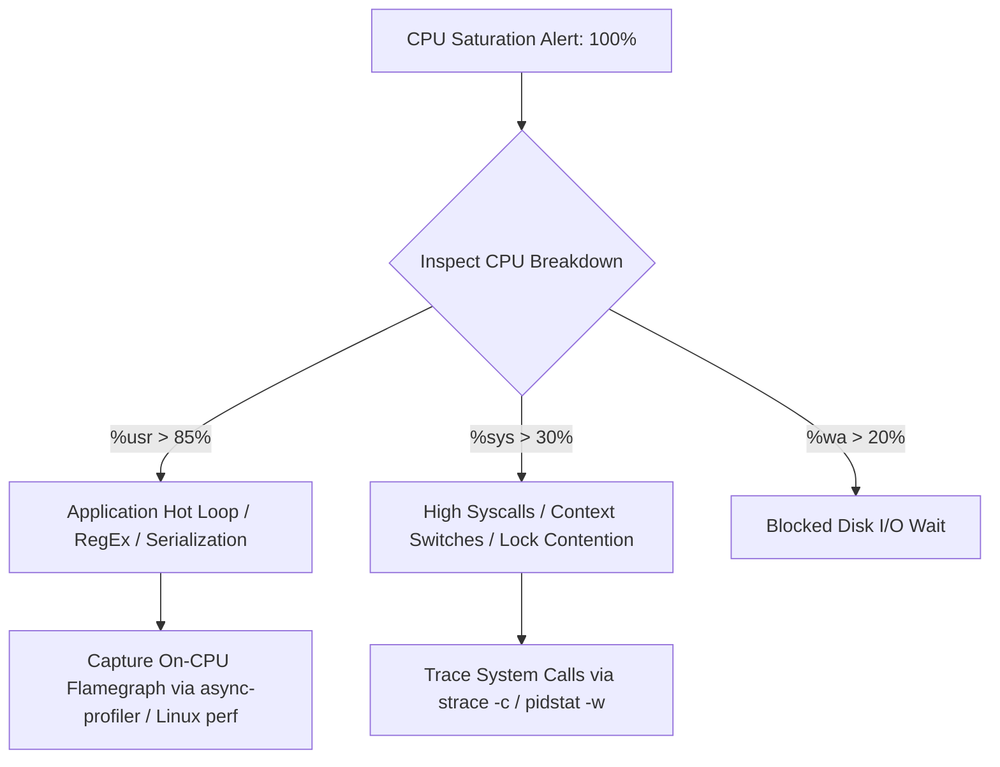

# 03. CPU Saturation, Hot Loops, and On-CPU Profiling

## 1. Problem
A critical service CPU utilization pegs at $100\%$, increasing request queueing delays and causing p99 latency to spike from 10ms to 5,000ms.

## 2. Production Context
CPU saturation is rarely distributed evenly across code: it is typically concentrated in a single hot loop, regular expression catastrophic backtracking, unoptimized JSON serialization, or excessive lock spinlocks.

## 3. Mental Model
$$\text{Total CPU Time} = \mathbf{\%usr} \text{ (User Application Code)} + \mathbf{\%sys} \text{ (Kernel Syscalls \& Context Switches)} + \mathbf{\%irq} \text{ (Hardware Interrupts)}$$
- **High `%usr`**: Application algorithms, JSON serialization, compression, cryptographic hashing, hot while-loops.
- **High `%sys`**: System call overhead (excessive `read`/`write` in small chunks), memory page allocation, lock contention.

## 4. System Diagram


## 5. Signals
- CPU utilization at $100\%$ on one or more cores.
- `cpu_throttled_seconds_total` rising rapidly in containerized workloads.
- Thread queue depth exploding while throughput drops.

## 6. Failure Modes
- **Catastrophic RegEx Backtracking (ReDoS)**: A poorly authored regular expression evaluating an untrusted string in $O(2^N)$ time.
- **Spinlock Starvation**: Threads in a tight `while (!flag)` spin loop consuming 100% CPU cycles instead of using condition variables or blocking queues.

## 7. Detection
```bash
# 1. Inspect per-thread CPU utilization
top -H -p <pid>

# 2. Convert high-CPU thread ID from Decimal to Hexadecimal (for matching in JVM thread dump)
printf "0x%x\n" <thread_id>

# 3. Capture On-CPU Stack Traces using async-profiler (Java)
./asprof -d 30 -f /data/flamegraph.html <pid>

# 4. Capture Linux system-wide On-CPU profile using perf
perf record -F 99 -p <pid> -g -- sleep 30
perf report
```

## 8. Diagnosis
1. Identify the specific native thread ID consuming the highest CPU percentage using `top -H -p <pid>`.
2. Map the thread ID (in hex `nid=0x...`) to the thread dump stack trace (`jstack <pid>`).
3. Inspect the exact line of code where the thread is looping.

## 9. Mitigation
- Scale deployment replicas horizontally to distribute load across more CPU cores.
- Enable rate limiting or drop traffic from abusive IPs triggering ReDoS patterns.

## 10. Recovery
- Hot-patch the regular expression or algorithmic hot loop.
- Apply cached serialization payloads to eliminate repetitive JSON conversions.

## 11. Verification
- Confirm CPU utilization drops below $65\%$ under peak production traffic.
- Verify Flamegraph shows flat, distributed call stacks rather than a tall bottleneck tower.

## 12. Prevention
- Enforce timeouts on all regular expression evaluations (`Pattern.compile().matcher()`).
- Include CPU Flamegraph benchmarks in load test CI pipelines.

## 13. Automation
- Automated continuous profiling using Grafana Pyroscope or Google Cloud Profiler in production.

## 14. Performance
- On-CPU profiling using low-overhead kernel sampling (`perf_events` / `AsyncGetCallTrace`) has $< 1\%$ CPU impact during data collection.

## 15. Reliability
- Setting cgroup CPU requests guarantees baseline compute share; avoid setting overly restrictive CPU limits that induce unnecessary throttling.

## 16. Trade-offs
- **CPU Limits vs Throttling**: In Kubernetes, setting hard `limits.cpu` triggers the Completely Fair Scheduler (CFS) quota enforcer, causing latency spikes even when the host node has idle CPU capacity. Many production organizations set only `requests.cpu` without hard limits.

## 17. Production Example
At fictional travel portal *SkyRoute*, the search API experienced 100% CPU spikes whenever users searched flights from "Paris". A production engineer generated an On-CPU Flamegraph using `async-profiler` and discovered that $68\%$ of total CPU time was spent inside a regex evaluating airport codes: `^([A-Z0-9]+)*$`. Refactoring the regex to a linear check (`^[A-Z0-9]{3}$`) dropped CPU utilization from $100\%$ to $14\%$, eliminating all search latency.

## 18. Interview Questions
- **Q1**: *How do you map a high-CPU Linux thread ID from `top -H` to a Java thread dump?*
- **Q2**: *Why can Kubernetes CPU limits cause latency spikes even when host CPU is only 50% utilized?*
- **Q3**: *How does an On-CPU Flamegraph work, and what does the width of a box represent?*

## 19. Strong Interview Answer
> *"To diagnose a high-CPU incident on a multi-threaded service, I run `top -H -p <pid>` to identify the specific OS thread ID consuming CPU cycles. I convert that thread ID to hexadecimal (`printf '0x%x' <tid>`) and search for the matching native thread ID (`nid=0x...`) in a JVM thread dump (`jcmd <pid> Thread.print`), pinpointing the exact method and line of code executing the hot loop. For comprehensive analysis, I capture an On-CPU Flamegraph using async-profiler or Linux perf: in a Flamegraph, the horizontal axis represents 100% of sampled CPU time, and the width of each box indicates the percentage of CPU time spent inside that function, allowing instant identification of bottlenecks."*

## 20. Hands-on Exercise
1. **Setup**: Run `top -b -n 1` and observe the `%Cpu(s)` line.
2. **Experiment**: Run an infinite while-loop in a bash background thread: `bash -c 'while true; do :; done' &`.
3. **Observe**: Find the PID (`pgrep -f "while true"`) and inspect its single-core saturation in `top -p <pid>`.
4. **Cleanup**: Kill the process: `kill -9 <pid>`.
