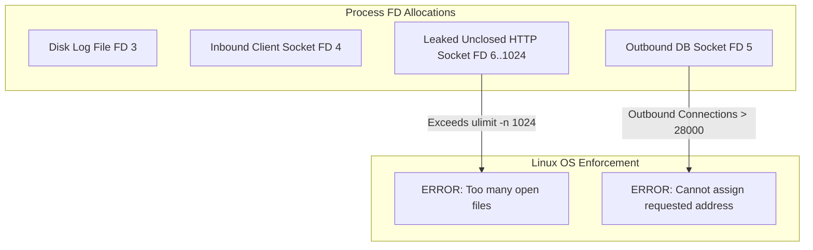

# 04. File Descriptor and Socket Port Exhaustion

## 1. Problem
A high-traffic service abruptly rejects all new connections with `java.io.IOException: Too many open files` or `bind: Address already in use` (ephemeral port exhaustion), halting all API traffic.

## 2. Production Context
In Linux, **"everything is a file"**: disk files, network sockets, pipes, and event loops (epoll instances) all consume **File Descriptors (FDs)**. When an application leaks unclosed HTTP connections or database sockets, it hits OS or process-level limits.

## 3. Mental Model
$$\mathbf{Three\ Layers\ of\ File\ Descriptor\ Limits:}$$
1. **System-wide Kernel Limit**: `/proc/sys/fs/file-max` (Maximum FDs across the entire OS).
2. **User / Process Limit (ulimit)**: `ulimit -n` / `RLIMIT_NOFILE` (Maximum FDs per single process).
3. **Local Ephemeral Port Range**: `/proc/sys/net/ipv4/ip_local_port_range` (Available source ports for outbound TCP connections, default ~28,232 ports).

## 4. System Diagram


## 5. Signals
- Application error: `java.net.SocketException: Too many open files`.
- Client error: `Cannot assign requested address` (EADDRNOTAVAIL - Ephemeral port exhaustion).
- High socket count in `TIME_WAIT` state in `ss -s`.

## 6. Failure Modes
- **HTTP Client Connection Leak**: Creating a new `HttpClient` instance per request without connection pooling, leaving thousands of sockets in `TIME_WAIT` or unclosed.
- **Low Default ulimit**: Default system limit of 1,024 open files on a service receiving 5,000 concurrent connections.

## 7. Detection
```bash
# 1. Count active open FDs for a process
lsof -p <pid> | wc -l
# or
ls -1 /proc/<pid>/fd | wc -l

# 2. Check process hard/soft limits
cat /proc/<pid>/limits | grep "open files"

# 3. Inspect TCP socket states
ss -s

# 4. Check ephemeral port range
cat /proc/sys/net/ipv4/ip_local_port_range
```

## 8. Diagnosis
1. Inspect the types of file descriptors being leaked:
   `lsof -p <pid> | awk '{print $5}' | sort | uniq -c | sort -nr`
2. If `sock` dominates: Check destination IPs to see which downstream dependency connections are being leaked:
   `lsof -i -a -p <pid>`

## 9. Mitigation
- Increase process file descriptor limit dynamically:
  `prlimit --pid <pid> --nofile=65536:65536`
- Enable TCP TIME_WAIT socket reuse for outbound connections:
  `sysctl -w net.ipv4.tcp_tw_reuse=1`

## 10. Recovery
- If the process is deadlocked from FD starvation, restart the container and immediately inspect the leaked FD log.

## 11. Verification
- Confirm open FD count remains stable ($< 20\%$ of `RLIMIT_NOFILE`) under sustained load.

## 12. Prevention
- Configure systemd service units with `LimitNOFILE=65536`.
- Always use singleton HTTP connection pools (Apache HttpClient / OkHttp) with explicit connection keep-alive.

## 13. Automation
- Alert in Prometheus when `process_open_fds / process_max_fds > 0.80`.

## 14. Performance
- Reusing connection pools eliminates TCP 3-way handshakes and TLS cryptographic negotiations on every request.

## 15. Reliability
- Ephemeral port exhaustion can be avoided by utilizing HTTP/2 or gRPC multiplexing over a single persistent connection.

## 16. Trade-offs
- **`tcp_tw_reuse` vs TIME_WAIT Safety**: Enabling `tcp_tw_reuse` allows outbound connection reuse safely when timestamps are enabled (`tcp_timestamps=1`), but should not be confused with the obsolete and dangerous `tcp_tw_recycle`.

## 17. Production Example
At fictional notification service *AlertNest*, sending webhooks to external customers began failing with `Cannot assign requested address`. The service had 28,000 sockets stuck in `TIME_WAIT`. An SRE discovered that the Java webhook dispatcher was instantiating a new `RestTemplate` on every dispatch call rather than using a pooled `CloseableHttpClient`. Refactoring to a pooled connection manager and enabling `net.ipv4.tcp_tw_reuse=1` reduced active socket count from 28,000 to 120 and eliminated all webhook failures.

## 18. Interview Questions
- **Q1**: *What happens in Linux when an application exhausts its file descriptor limit?*
- **Q2**: *Why do sockets enter the TIME_WAIT state, and how long do they remain there?*
- **Q3**: *How do you solve ephemeral port exhaustion when communicating with a single downstream microservice?*

## 19. Strong Interview Answer
> *"In Linux, every TCP socket, disk file, and epoll descriptor consumes a process-level file descriptor. When an application exceeds its `RLIMIT_NOFILE` limit, any subsequent `open()`, `socket()`, or `accept()` system call fails with `EMFILE (Too many open files)`. A related failure mode is ephemeral port exhaustion: when a client opens and closes thousands of short-lived TCP connections, the sockets linger in `TIME_WAIT` for $2 \times \text{MSL}$ (60 seconds) to ensure in-flight duplicate packets from the previous connection drain safely. To prevent this in high-throughput systems, we configure pooled HTTP/2 or gRPC clients that keep connections alive and multiplex requests over persistent sockets, raise `LimitNOFILE` to 65,536+, and enable `net.ipv4.tcp_tw_reuse=1`."*

## 20. Hands-on Exercise
1. **Setup**: Inspect your current shell file descriptor limit: `ulimit -n`.
2. **Count Open FDs**: Count the open FDs of your current shell: `ls -1 /proc/$$/fd | wc -l`.
3. **Inspect Active Sockets**: Run `ss -s` to view the count of TCP sockets in `ESTAB`, `TIME-WAIT`, and `CLOSE-WAIT`.
