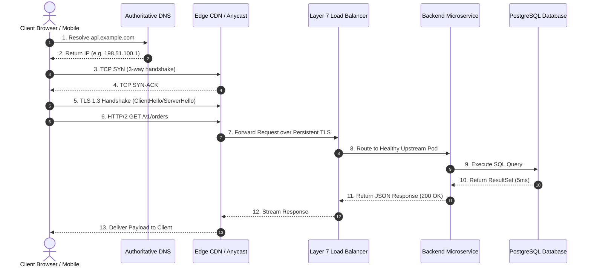

# 01. The End-to-End Request Path

## 1. Problem
When an end-user experiences a 2-second delay loading a web page, engineers often blame application code without realizing that $80\%$ of the latency can be spent across DNS lookups, TCP 3-way handshakes, TLS session negotiation, and reverse-proxy queueing.

## 2. Production Context
A single user tap triggers a complex chain of physical and logical hops across public and private networks. Production engineers must decompose end-to-end latency across the full request journey.

## 3. Mental Model
$$\text{Total User Latency} = \mathbf{T}_{\text{DNS}} + \mathbf{T}_{\text{TCP}} + \mathbf{T}_{\text{TLS}} + \mathbf{T}_{\text{LB/Proxy}} + \mathbf{T}_{\text{App}} + \mathbf{T}_{\text{DB/Cache}} + \mathbf{T}_{\text{Transit}}$$

## 4. System Diagram


## 5. Signals
- **DNS Bottleneck**: High `time_namelookup` in `curl` ($> 200\text{ms}$).
- **TCP Latency**: High `time_connect` ($> 100\text{ms}$ indicating high RTT / cross-continent routing).
- **TLS Overhead**: High `time_appconnect` ($> 150\text{ms}$ indicating full cryptographic renegotiation).

## 6. Failure Modes
- **Cold TCP/TLS Connections**: Every client request opening a new connection, multiplying round-trips ($3 \times \text{RTT}$ before any data is sent).
- **Proxy Buffer Starvation**: Load balancer buffer full, pausing TCP transmission windows (TCP ZeroWindow).

## 7. Detection
```bash
# Decompose HTTP request latency hops with curl
curl -w "\nDNS Lookup: %{time_namelookup}s\nTCP Handshake: %{time_connect}s\nTLS Negotiate: %{time_appconnect}s\nPre-transfer: %{time_pretransfer}s\nStart Transfer (TTFB): %{time_starttransfer}s\nTotal Time: %{time_total}s\n" \
  -o /dev/null -s https://api.github.com
```

## 8. Diagnosis
- If `time_namelookup` is high: DNS caching is misconfigured or ISP resolver is failing.
- If `time_connect` is high: Physical geographic distance (RTT) or network packet loss.
- If `time_starttransfer - time_pretransfer` is high: Server-side application or database processing is slow (TTFB issue).

## 9. Mitigation
- Terminate TLS at edge CDN nodes geographically close to the user (Anycast routing).
- Enable HTTP/2 or HTTP/3 (QUIC) connection multiplexing and TLS Session Resumption.

## 10. Recovery
- Drain traffic to healthy edge points of presence (PoPs).
- Flush stale DNS caches at resolvers if pointing to dead IPs.

## 11. Verification
- Confirm `curl` TTFB drops to $< 50\text{ms}$ from edge locations.
- Verify distributed tracing spans record client-edge time vs internal service execution time.

## 12. Prevention
- Set appropriate DNS TTLs (e.g. 60s for dynamic services; 300s for stable edge endpoints).
- Use persistent HTTP connection pooling (`Keep-Alive`) between proxies and backend applications.

## 13. Automation
- Global synthetic monitoring probes measuring DNS, TCP, and TLS handshake latency from 30+ international cities every minute.

## 14. Performance
- TLS 1.3 reduces the cryptographic handshake from 2 round-trips (TLS 1.2) to **1 round-trip (1-RTT)**, or **0-RTT** with Early Data.

## 15. Reliability
- Dual Anycast BGP routing provides automatic network-layer failover if a transit provider suffers fiber cuts.

## 16. Trade-offs
- **Short DNS TTL vs Resolver Load**: A 10-second TTL allows near-instant traffic shifting during outages but increases DNS query volume by $10\times$.

## 17. Production Example
At fictional fintech *NovaBank*, mobile users in Tokyo experienced 1,200ms latency calling an API hosted in US-East. An SRE decomposed the request path and found: DNS took 120ms, TCP handshake took 180ms, TLS negotiation took 360ms ($2 \times \text{RTT}$), and internal app processing took only 30ms. Deploying an Anycast Edge CDN in Tokyo to terminate TCP/TLS locally and proxying traffic over dedicated cloud backbone fibers reduced user-perceived latency from 1,200ms to 210ms ($82\%$ reduction).

## 18. Interview Questions
- **Q1**: *How does HTTP/2 multiplexing eliminate the Head-of-Line (HoL) blocking problem of HTTP/1.1?*
- **Q2**: *What is Time-to-First-Byte (TTFB), and how do you determine whether a high TTFB is caused by network or application code?*
- **Q3**: *How does TLS 1.3 reduce connection setup latency compared to TLS 1.2?*

## 19. Strong Interview Answer
> *"To diagnose request path latency, I decompose the journey into transport, security, and application phases. Transport overhead includes DNS resolution and the TCP 3-way handshake, bounded by the speed-of-light Round Trip Time (RTT). Security overhead includes TLS negotiation: TLS 1.2 requires 2-RTTs (ClientHello, ServerHello, Key Exchange, Cipher Spec), whereas TLS 1.3 completes the handshake in 1-RTT by combining key exchange with the initial greeting. Finally, Application Latency represents Time to First Byte (TTFB) minus pre-transfer time. If TTFB is high while TLS is fast, the bottleneck is server-side compute, database lock contention, or upstream proxy queueing."*

## 20. Hands-on Exercise
1. **Setup**: Run the `curl` timing format command against your local web server or a public API.
2. **Observe**: Note the breakdown between `time_connect` (TCP), `time_appconnect` (TLS), and `time_starttransfer` (TTFB).
