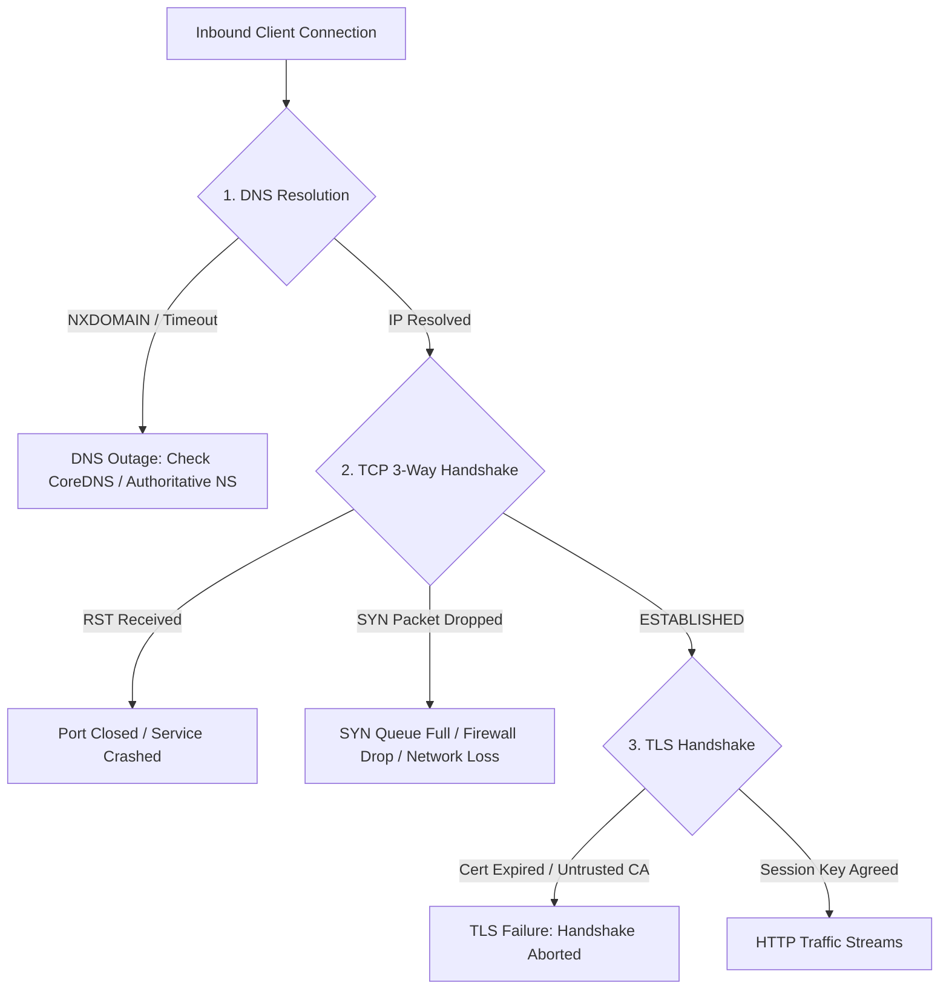

# 02. DNS, TCP, and TLS Failure Modes in Production

## 1. Problem
Low-level networking failures—such as expired TLS certificates, DNS resolution timeouts, TCP SYN queue overflows, and MTU blackholes—cause total service outages that bypass application error logs.

## 2. Production Context
When networks degrade, errors manifest in edge ingress controllers and reverse proxies. Production engineers must isolate whether failure is happening at the Name resolution layer (DNS), Transport layer (TCP), or Presentation layer (TLS).

## 3. Mental Model
$$\begin{aligned}
\mathbf{DNS\ Failure} &\implies \texttt{UnknownHostException} \text{ / } \texttt{NXDOMAIN} \text{ / Resolution Timeout} \\
\mathbf{TCP\ Failure} &\implies \texttt{Connection refused} \text{ (RST) / } \texttt{Connection timed out} \text{ (SYN dropped)} \\
\mathbf{TLS\ Failure} &\implies \texttt{SSLHandshakeException} \text{ / } \texttt{Certificate expired} \text{ / Cipher mismatch}
\end{aligned}$$

## 4. System Diagram


## 5. Signals
- **DNS Failures**: JVM `java.net.UnknownHostException`, `dig` returning `SERVFAIL` or timing out after 5000ms.
- **TCP SYN Drops**: `netstat -s | grep -i "listen overflows"` or `SYN-RECV` sockets accumulating in `ss -s`.
- **TLS Expirations**: Browsers displaying `NET::ERR_CERT_DATE_INVALID`, curl returning `SSL certificate problem: certificate has expired`.

## 6. Failure Modes
- **JVM DNS Caching Forever**: By default, legacy JVMs cached successful DNS lookups indefinitely (`networkaddress.cache.ttl = -1`), preventing backend traffic from switching when load balancer IPs changed during failover.
- **TCP Listen Queue Overflow**: Backlog of unaccepted connections exceeding `/proc/sys/net/core/somaxconn` and `tcp_max_syn_backlog`, silently dropping new client SYN packets.
- **Negative DNS Caching**: Resolver caching an `NXDOMAIN` response during a brief 2-second DNS restart, continuing to fail queries for 5 minutes (governed by SOA minimum TTL).

## 7. Detection
```bash
# 1. Test DNS resolution with dig and trace delegation
dig +trace +stats api.example.com

# 2. Inspect TCP SYN queue drops and listen overflows on host
netstat -s | grep -E "overflows|dropped"
# or
nstat -az TcpExtListenOverflows TcpExtListenDrops

# 3. Check TLS certificate expiration date and chain via openssl
echo | openssl s_client -servername api.example.com -connect api.example.com:443 2>/dev/null | openssl x509 -noout -dates -issuer
```

## 8. Diagnosis
- If `TcpExtListenOverflows` is incrementing: Application process is not calling `accept()` fast enough $\implies$ Worker threads blocked or thread pool exhausted.
- If `dig` returns `SERVFAIL`: Authoritative DNS name server is down or DNSSEC validation failed.

## 9. Mitigation
- For TCP queue drops: Increase socket backlog in app (`server.tomcat.accept-count=2048`) and kernel:
  `sysctl -w net.core.somaxconn=4096`
  `sysctl -w net.ipv4.tcp_max_syn_backlog=4096`
- For JVM DNS caching: Set JVM security property `networkaddress.cache.ttl=30`.

## 10. Recovery
- Renew and deploy TLS certificates via automated certificate manager (Let's Encrypt / Vault).
- Flush CoreDNS caching pods in Kubernetes: `kubectl rollout restart deployment/coredns -n kube-system`.

## 11. Verification
- Verify `openssl s_client` returns `Verify return code: 0 (ok)`.
- Confirm `TcpExtListenOverflows` stops incrementing under peak load.

## 12. Prevention
- Configure alerts on TLS certificate expiration 30, 14, and 7 days prior to expiry.
- Use automated certificate rotation controllers (cert-manager).

## 13. Automation
- Automated CI pipeline checking public domain cert expiration dates daily.

## 14. Performance
- TCP SYN Cookies (`net.ipv4.tcp_syncookies=1`) allow the kernel to withstand SYN flood attacks without consuming memory tables.

## 15. Reliability
- Dual DNS providers (e.g. Route53 + Cloudflare DNS) protect against global DNS provider outages.

## 16. Trade-offs
- **Short DNS TTL vs Resilience**: Very short TTLs (5s) allow rapid failover but leave services vulnerable if the DNS provider experiences a transient 10-second outage.

## 17. Production Example
At fictional travel portal *FlyGlobal*, a payment service suddenly failed to connect to Stripe, logging thousands of `UnknownHostException` errors. An SRE investigated CoreDNS and found that upstream DNS resolvers were dropping UDP packets under a DDoS attack. The SRE switched CoreDNS to forward queries over DNS-over-HTTPS (DoH) over TCP and increased CoreDNS local cache TTL to 300 seconds, immediately restoring payment processing.

## 18. Interview Questions
- **Q1**: *What is the difference between TCP SYN backlog and the application listen backlog (`somaxconn`)?*
- **Q2**: *Why did JVMs historically cache DNS lookups forever, and how should it be configured in cloud environments?*
- **Q3**: *How do you debug an issue where `curl` hangs for 30 seconds before failing with `Connection timed out`?*

## 19. Strong Interview Answer
> *"When a client initiates a TCP connection, the Linux kernel manages two queues: the SYN Queue (for connections in SYN-RECEIVED state completing the 3-way handshake) and the Listen/Accept Queue (for fully established connections waiting for the application process to invoke `accept()`). If the application thread pool is saturated, the Listen Queue fills up. When the queue overflows, the kernel (by default, when `tcp_abort_on_overflow=0`) silently drops incoming ACK packets, forcing the client to retransmit and manifest as connection timeouts. In cloud environments where load balancer IPs change dynamically, setting JVM `networkaddress.cache.ttl=30` is essential to prevent stale IP resolution after automated failovers."*

## 20. Hands-on Exercise
1. **Setup**: Inspect your system's TCP listen backlog limit: `sysctl net.core.somaxconn`.
2. **Inspect Cert**: Check the certificate expiration of any major domain:
   `echo | openssl s_client -servername google.com -connect google.com:443 2>/dev/null | openssl x509 -noout -dates`.
