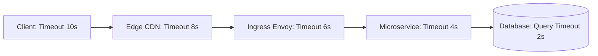

# 03. Load Balancers, Proxies, and Timeout Cascades

## 1. Problem
Misconfigured timeouts across proxy layers (Edge CDN $\to$ Cloud Load Balancer $\to$ Ingress NGINX / Envoy $\to$ Microservice $\to$ Database) cause **HTTP 504 Gateway Timeouts**, connection leaks, and wasted backend computation.

## 2. Production Context
In distributed microservices, a request traverses multiple proxy hops. If an outer proxy has a *shorter* timeout than an inner service, the client gives up while the backend continues wasting expensive CPU and database resources on orphaned work.

## 3. Mental Model: The Strict Timeout Invariant Rule
$$\mathbf{Timeout}_{\text{Client}} > \mathbf{Timeout}_{\text{Edge}} > \mathbf{Timeout}_{\text{Ingress}} > \mathbf{Timeout}_{\text{Service}} > \mathbf{Timeout}_{\text{Database}}$$
*Every outer layer must give inner layers enough time to complete, report an error, and clean up before timing out.*

## 4. System Diagram


---

## 5. Deconstructing Timeout Types

| Timeout Type | Where It Applies | What It Governs | Typical Production Value |
| :--- | :--- | :--- | :--- |
| **Connect Timeout** | TCP Handshake | Max time allowed to establish initial TCP connection | $500\text{ms} - 2\text{s}$ |
| **Socket Read Timeout** | Data Streaming | Max gap of inactivity between consecutive data packets | $3\text{s} - 10\text{s}$ |
| **Request Timeout** | Full Request Lifecycle | Total end-to-end deadline for entire request/response | $5\text{s} - 30\text{s}$ |
| **Idle / Keep-Alive Timeout** | Connection Pool | Max time an idle socket remains open before closure | $60\text{s} - 300\text{s}$ |

---

## 6. L4 vs. L7 Load Balancing

| Dimension | Layer 4 (TCP/UDP Proxy - AWS NLB) | Layer 7 (Application Proxy - Envoy / NGINX / ALB) |
| :--- | :--- | :--- |
| **OSI Layer** | Transport (IP & Port only) | Application (HTTP headers, paths, cookies, gRPC) |
| **Packet Inspection** | Zero payload inspection; packet forwarding | Terminates TLS, parses HTTP headers, buffers payload |
| **Latency / Throughput**| Extreme throughput (millions RPS), $< 1\text{ms}$ overhead | Moderate overhead ($2-5\text{ms}$), rich routing features |
| **Routing Capability** | IP Hash, Round Robin | Path-based `/api/v1`, header-based, weighted canary |

---

## 7. HTTP Status Code Triage (502 vs 503 vs 504)

```
                              Proxy Error Triage
                                      │
        ┌─────────────────────────────┼─────────────────────────────┐
        ▼                             ▼                             ▼
   HTTP 502 Bad Gateway       HTTP 503 Service Unavail     HTTP 504 Gateway Timeout
 Upstream backend crashed,   No healthy backend pods in   Upstream accepted request
 sent TCP RST, or returned   upstream load balancer pool  but took longer than proxy
 invalid non-HTTP response.  (all failing health checks). read timeout to respond.
```

---

## 8. Interview Questions & Model Answers

**Q1: What is the root cause of an HTTP 504 Gateway Timeout vs an HTTP 502 Bad Gateway?**
**Answer**: An **HTTP 502 Bad Gateway** indicates that the proxy received an invalid response or a connection reset (TCP RST) from the upstream backend (e.g. the backend process crashed, the port is closed, or TLS negotiation between proxy and backend failed). An **HTTP 504 Gateway Timeout** indicates that the proxy successfully connected to the upstream backend, but the backend took longer than the proxy's configured `proxy_read_timeout` to complete processing and send a response.

**Q2: Why must timeouts decrease monotonically as you move deeper into the architecture?**
**Answer**: If a reverse proxy has a 5-second timeout but the backend database query timeout is set to 30 seconds, the proxy will timeout at 5 seconds and return an HTTP 504 to the user. However, the backend service and database will continue running the slow 30-second query to completion, wasting database CPU, memory, and connection pool resources on a response that the client has already abandoned. Enforcing strictly decreasing timeouts ensures the deepest layer fails first and propagates a structured error upward.
