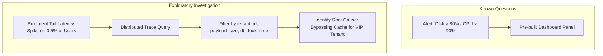

# 01. Observability vs. Monitoring: Debugging Unknown-Unknowns

## 1. Problem
Traditional monitoring tools tell you *that* a system is broken (e.g. "HTTP 500 error rate is 8%"), but provide zero insight into *why* it is broken, forcing on-call engineers to guess, add debug logs, and redeploy code during an active outage.

## 2. Production Context
In monolithic architectures with predictable failure modes, dashboard monitoring was sufficient. In modern distributed cloud microservices with hundreds of asynchronous dependencies, failures are emergent and non-linear. Observability is a mathematical property of a system: the ability to deduce its internal state purely from its external outputs.

## 3. Mental Model
$$\begin{aligned}
\mathbf{Monitoring} &\implies \text{Tracking known health metrics against predefined thresholds (Known-Knowns)} \\
\mathbf{Observability} &\implies \text{Interrogating telemetry to understand novel, emergent failure modes (Unknown-Unknowns)}
\end{aligned}$$

## 4. System Diagram

## 5. Signals
- **Monitoring Signal**: "Checkout service latency p99 is 4.2s (Alert Fired)."
- **Observability Signal**: "Requests where `tenant_id = 9481` and `cart_items > 50` are triggering serial table scans on shard 3 because an unindexed JSON attribute was added."

## 6. Failure Modes
- **Dashboard Clutter**: Hundreds of sprawling Grafana dashboards that nobody understands during an incident.
- **The Redeploy-to-Debug Anti-Pattern**: Needing to merge and deploy code with `log.info()` statements to diagnose a production bug.

## 7. Detection
- Ask: *Can the on-call engineer isolate why a specific request failed for a single user using telemetry alone without SSHing into the box?*

## 8. Diagnosis
1. Query distributed tracing for failed span IDs.
2. Correlate span tags with structured log attributes (`trace_id`, `span_id`).
3. Formulate and test differential hypotheses using ad-hoc metric aggregations.

## 9. Mitigation
- Standardize on OpenTelemetry (OTel) across all microservices for unified trace/metric context injection.

## 10. Recovery
- Resolve the specific isolated bottleneck identified via trace spans.

## 11. Verification
- Confirm p99 latency recovers across the isolated tenant subset.

## 12. Prevention
- Enforce distributed trace propagation on all internal and outbound HTTP/gRPC clients.

## 13. Automation
- Automated anomaly detection flagging statistical outliers in multidimensional telemetry.

## 14. Performance
- Efficient trace sampling (e.g. 1% head sampling + 100% error tail sampling) provides full observability with negligible CPU and network overhead.

## 15. Reliability
- High observability reduces Mean Time to Detect (MTTD) and Mean Time to Mitigate (MTTM).

## 16. Trade-offs
- **Full Trace Retention vs Storage Cost**: Retaining 100% of distributed traces generates terabytes of data daily; tail-based sampling retains all error and high-latency traces while discarding uniform fast requests.

## 17. Production Example
At fictional e-commerce platform *ShopScale*, users in Germany intermittently reported checkout timeouts. Monitoring dashboards showed green across CPU, database IOPS, and average latency. Using distributed tracing, an SRE filtered traces with `duration > 3000ms` and discovered that German users were triggering a third-party postal code validation service that hung for 5,000ms when handling 5-digit alphanumeric postal formats. The issue was pinpointed in 3 minutes without touching server logs.

## 18. Interview Questions
- **Q1**: *What is the fundamental difference between Monitoring and Observability?*
- **Q2**: *Why are pre-built Grafana dashboards insufficient for diagnosing complex distributed systems outages?*
- **Q3**: *How does tail-based sampling differ from head-based sampling in distributed tracing?*

## 19. Strong Interview Answer
> *"Monitoring is the operational practice of checking whether a system is working by measuring known failure indicators against predefined thresholds. Observability, derived from control theory, is the degree to which we can infer the internal states of a system based solely on its external telemetry outputs. Monitoring asks questions we anticipated in advance ('Is CPU > 85%?'); Observability allows us to ask novel, exploratory questions about unknown-unknowns without deploying new code—such as isolating why a single tenant experiences 5-second latency on a specific database shard when all global metrics appear healthy."*

## 20. Hands-on Exercise
1. **Setup**: Inspect an OpenTelemetry span definition in Java or Go.
2. **Experiment**: Attach custom dimensional attributes: `span.setAttribute("tenant.id", tenantId)`.
3. **Observe**: Query the trace in Jaeger / Grafana Tempo using the custom attribute tag.
