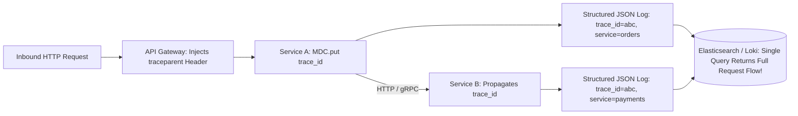

# 01. Structured Logging, Correlation IDs, and Sensitive Data Handling

## 1. Problem
Unstructured plain-text logs (e.g. `System.out.println("Processing order for user: " + userId)`) are impossible to query, aggregate, or correlate across distributed microservices, and frequently leak sensitive PII (credit cards, passwords, SSNs) into logging indices.

## 2. Production Context
In cloud microservices emitting gigabytes of log events per second, logs must be machine-parseable JSON objects enriched with standard metadata and correlation IDs.

## 3. Mental Model
$$\text{Production Log Event} = \mathbf{Timestamp} + \mathbf{Level} + \mathbf{ServiceContext} + \mathbf{TraceContext\ (trace\_id,\ span\_id)} + \mathbf{Payload}$$

## 4. System Diagram


## 5. Production Structured Log Example (JSON)
```json
{
  "@timestamp": "2026-09-03T14:32:05.120Z",
  "log.level": "ERROR",
  "service.name": "payment-service",
  "service.version": "v2.1.0",
  "environment": "production",
  "trace.id": "4bf92f3577b34da6a3ce929d0e0e4736",
  "span.id": "00f067aa0ba902b7",
  "user.id": "usr_99812",
  "http.route": "/v1/charges",
  "http.status_code": 504,
  "message": "Payment gateway timeout after 5000ms",
  "error.type": "java.net.SocketTimeoutException",
  "error.stack_trace": "java.net.SocketTimeoutException: Read timed out\n\tat java.base/sun.nio.ch..."
}
```

## 6. PII Masking Architecture
Never log unmasked sensitive data:
- **Credit Cards**: Retain only last 4 digits (`4111-XXXX-XXXX-1234`).
- **Authorization Headers**: Sanitize `Bearer eyJ...` to `Bearer [REDACTED]`.
- **Passwords / Secrets**: Strip from JSON payloads via Logback masking filters before emission to stdout.

## 7. Interview Questions & Model Answers

**Q1: How does Mapped Diagnostic Context (MDC) work in Java logging, and how do you handle it in asynchronous / reactive code?**
**Answer**: MDC uses `ThreadLocal` storage in the JVM to associate contextual key-value pairs (such as `trace_id`, `tenant_id`, and `user_id`) with the executing thread, automatically injecting them into every log statement emitted by that thread. However, in asynchronous or reactive frameworks (like Spring WebFlux, CompletableFuture, or thread pools) where tasks switch threads during execution, standard `ThreadLocal` context is lost. To preserve MDC across asynchronous boundaries, we must use task decorators (e.g. wrapping `Runnable`/`Callable` to capture and restore the MDC map) or use reactive context propagation libraries (`Micrometer Context Propagation` / Project Reactor `subscriberContext`).

**Q2: What is the operational cost of excessive logging in high-throughput production environments?**
**Answer**: Excessive logging introduces severe performance penalties:
1. **CPU Overhead**: Serializing rich JSON objects and formatting stack traces consumes significant CPU cycles.
2. **Lock Contention**: Synchronous logging appenders cause worker threads to block on shared log file locks.
3. **Disk & Network I/O Saturation**: Writing gigabytes of logs saturates container disk I/O and network bandwidth to logging collectors.
4. **Storage Cost**: Retaining petabytes of unindexed debug logs in Elasticsearch/Datadog inflates infrastructure bills. In production, we enforce **Asynchronous Logging** (Logback `AsyncAppender` with a ring buffer) and default to `INFO` or `WARN` levels.
