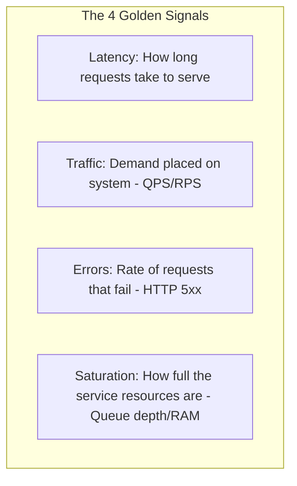

# 01. Designing Actionable Alerts: The SRE Alerting Philosophy

## 1. Problem
On-call engineers receive 50 pages a week for false alarms, transient CPU spikes, or warnings that require no immediate action, leading to **Alert Fatigue**, missed real outages, and engineer burnout.

## 2. Production Context
An alert that wakes an engineer up at 3 AM must represent an **urgent, user-impacting incident that requires immediate human intervention** and has an explicit, executable runbook.

## 3. Mental Model: The Golden Rule of Alerting
$$\mathbf{Every\ Page\text{-}Worthy\ Alert\ Must\ Satisfy\ 4\ Criteria:}$$
1. **Urgent**: Requires response within minutes (not next business day).
2. **Actionable**: A human must have concrete operational steps to take (not "just observing").
3. **User-Impacting**: Directly breaches or threatens to breach customer SLOs.
4. **Non-Transient**: The issue does not automatically resolve in 30 seconds.

## 4. The 4 Golden Signals (Google SRE Framework)
$$\mathbf{Latency} \quad\mid\quad \mathbf{Traffic} \quad\mid\quad \mathbf{Errors} \quad\mid\quad \mathbf{Saturation}$$

---

## 5. Alert Severity Classification Triage

| Severity | Notification Channel | Response SLA | When to Use | Example |
| :--- | :--- | :--- | :--- | :--- |
| **Sev-1 (Critical)** | PagerDuty (Phone Call / SMS) | **$< 5$ mins** | Total service outage, critical data loss, high error rate | Payment API 5xx error rate $> 5\%$ |
| **Sev-2 (Major)** | PagerDuty (Push Notification) | **$< 15$ mins** | Major feature degraded, error budget rapidly burning | Checkout p99 latency $> 3000\text{ms}$ |
| **Sev-3 (Minor)** | Dedicated Slack Channel | **Next Business Day** | Single node failed (redundancy active), non-urgent warning | Disk utilization at $75\%$ |
| **Sev-4 (Info)** | Jira Ticket / Automated PR | **Sprint Planning** | Minor capacity trend, certificate expires in 60 days | DB table bloat $> 20\%$ |

---

## 6. Interview Questions & Model Answers

**Q1: What is Alert Fatigue, and how do you mathematically measure and eliminate it?**
**Answer**: Alert Fatigue occurs when on-call engineers are subjected to a high volume of non-actionable, false-positive, or low-urgency notifications, desensitizing them and leading to missed critical alerts. To eliminate it, we track the **Actionability Ratio**: $\frac{\text{Alerts requiring operational intervention}}{\text{Total alerts received}} \times 100\%$. If this ratio drops below $80\%$, we audit the alert catalog: convert cause-based alerts (e.g. CPU > 80%) into dashboards, silence self-resolving alerts, enforce multi-window burn rate thresholds, and require that any alert without an actionable runbook be deleted.

**Q2: Why should you avoid alerting directly on CPU utilization thresholds in modern microservices?**
**Answer**: CPU utilization is an internal utilization signal, not a direct measure of customer satisfaction. A service running at 90% CPU may be operating with optimal hardware efficiency and delivering sub-10ms p99 latency with zero errors. Conversely, a deadlocked service at 5% CPU might be rejecting 100% of user traffic. Alerting on CPU causes false positives during normal traffic peaks and false negatives during application deadlocks. We alert on **Symptoms** (HTTP 5xx rate and p99 latency) and use CPU metrics on dashboards for diagnostic correlation.
