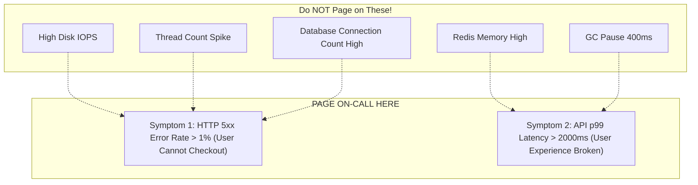

# 02. Symptom-Based vs. Cause-Based Alerting

## 1. Problem
Teams configure hundreds of cause-based alerts (e.g. "Host memory > 85%", "Thread count > 150", "Garbage collection took 200ms"), resulting in a barrage of 40 alerts firing simultaneously when a single database locks up, blinding the on-call engineer to the actual user symptom.

## 2. Production Context
A system can fail in infinite unexpected ways (causes), but user pain always manifests in a small, finite set of symptoms (latency, errors, data loss, unavailability).

## 3. Mental Model
$$\begin{aligned}
\mathbf{Cause\text{-}Based\ Alerting} &\implies \text{Alerting on internal mechanism assumptions (\textbf{Brittle \& Noisy})} \\
\mathbf{Symptom\text{-}Based\ Alerting} &\implies \text{Alerting directly on user-visible degradation (\textbf{Robust \& High Signal})}
\end{aligned}$$

## 4. System Diagram


---

## 5. Comparison: Symptom vs. Cause Alerts

| Attribute | Cause-Based Alert (Anti-Pattern) | Symptom-Based Alert (Best Practice) |
| :--- | :--- | :--- |
| **Rule Example** | `node_memory_MemAvailable_bytes < 1GB` | `job:http_request_error_rate:ratio_rate5m > 0.01` |
| **Why It Fails** | Linux page cache naturally consumes RAM; causes false alarms | Only triggers when real customer requests fail |
| **Coverage** | Misses novel, unpredicted root causes | Catches **100% of outages**, regardless of the underlying root cause |
| **Action** | Engineer logs in and finds app is operating normally | Engineer immediately initiates incident response |

---

## 6. Prometheus Alert Rule Example (Symptom-Based)

```yaml
groups:
  - name: service_symptom_alerts
    rules:
      - alert: HighErrorRate
        expr: |
          (
            sum(rate(http_requests_total{status=~"5.."}[5m]))
            /
            sum(rate(http_requests_total[5m]))
          ) > 0.02
        for: 2m
        labels:
          severity: critical
        annotations:
          summary: "Service error rate exceeds 2% for 2 minutes"
          description: "Current error rate is {{ $value | humanizePercentage }}. Customers experiencing checkout failures."
          runbook_url: "https://wiki.example.com/runbooks/high-error-rate"
```

---

## 7. Interview Questions & Model Answers

**Q1: Why is symptom-based alerting considered superior to cause-based alerting in Site Reliability Engineering?**
**Answer**: Symptom-based alerting aligns alerts directly with user pain and SLO error budget consumption. Because distributed systems exhibit an infinite combinatorial explosion of potential root causes, attempting to write cause-based alerts for every component leads to missing novel failure modes (false negatives) while creating hundreds of noisy alerts for benign transient spikes (false positives). Symptom-based alerts guarantee that the on-call engineer is notified whenever customer experience degrades, regardless of whether the root cause is a database lock, a network fiber cut, or a software memory leak.
