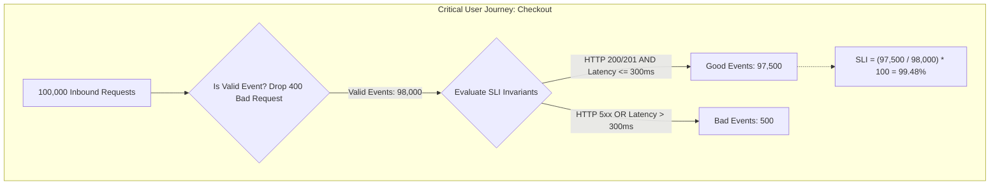

# 01. Defining Meaningful Service Level Indicators (SLIs)

## 1. Problem
Teams track hundreds of arbitrary technical metrics (e.g. JVM garbage collection pause times, CPU percentages) as SLIs, resulting in green dashboards while users are actively screaming about broken checkouts.

## 2. Production Context
An SLI must represent a **direct measurement of user satisfaction along a critical user journey**. If an SLI drops, users must be experiencing real friction; if an SLI is healthy, users must be happy.

## 3. Mental Model: The Standard SLI Ratio Specification
$$\mathbf{SLI} = \frac{\sum \mathbf{Good\ Events}}{\sum \mathbf{Total\ Valid\ Events}} \times 100\%$$

## 4. System Diagram

---

## 5. The 4 Canonical SLI Archetypes

| Archetype | Good Events Definition | Total Valid Events Definition | Example PromQL Ratio |
| :--- | :--- | :--- | :--- |
| **Availability** | Responses with HTTP status $\in \{200..499\}$ (excluding server 5xx) | All valid HTTP requests received at edge | $\frac{\text{sum}(\text{rate}(\text{http\_requests}\{status!\sim"5.."\}))}{\text{sum}(\text{rate}(\text{http\_requests}))}$ |
| **Latency** | Requests completed in $\le 250\text{ms}$ | All successful (2xx/3xx) HTTP requests | $\frac{\text{sum}(\text{rate}(\text{http\_duration\_bucket}\{le="0.25"\}))}{\text{sum}(\text{rate}(\text{http\_duration\_count}))}$ |
| **Freshness** | Data updates processed within $\le 5\text{s}$ of creation | Total data records ingested in Kafka stream | $\frac{\text{count}(\text{records with age} \le 5s)}{\text{total records ingested}}$ |
| **Correctness** | Ledger records passing double-entry balance validation | Total financial transaction records generated | $\frac{\text{count}(\text{balanced records})}{\text{total records}}$ |

---

## 6. Interview Questions & Model Answers

**Q1: Why should client-side HTTP 4xx errors (e.g. 400 Bad Request, 404 Not Found) typically be excluded from a service availability SLI?**
**Answer**: HTTP 4xx errors indicate client-side errors (such as invalid user input, malformed JSON bodies, or bad authentication tokens) where the backend service operated correctly by rejecting the invalid request. Including 4xx errors in an availability SLI would allow an external attacker or broken client script sending thousands of invalid requests to artificially burn the service's error budget, triggering false positive pages and halting feature releases when the service itself is 100% healthy. (Note: 429 Too Many Requests and 5xx errors *must* be tracked).

**Q2: Where in the architecture should an Availability SLI be measured?**
**Answer**: Measure SLIs **as close to the user as possible** (at the Edge CDN or API Load Balancer). Measuring availability solely on backend microservice pods misses critical failures occurring in intermediate layers, such as TLS handshake failures, Ingress routing crashes, or CDN configuration errors.
