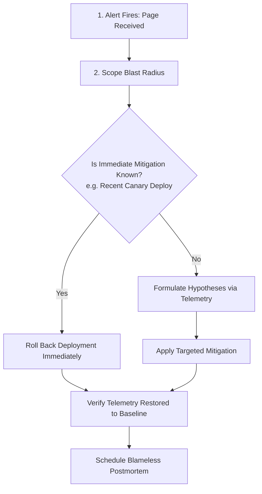

# 01. The Production Incident Lifecycle & the SIGNAL Protocol

## 1. Problem
During high-severity outages, engineering teams often panic: multiple engineers try random configuration changes simultaneously in production without communication, destroying forensic evidence and worsening the outage.

## 2. Production Context
A production incident is an operational emergency. Managing it requires a repeatable, structured protocol that decouples **Immediate Mitigation (stopping customer bleeding)** from **Root Cause Analysis (fixing the permanent bug)**.

## 3. Mental Model: The SIGNAL Protocol
```
S — Scope the impact (What percentage of traffic/revenue is failing?)
I — Inspect signals (RED metrics, recent deployments, database load)
G — Generate hypotheses (Formulate differential failure theories)
N — Narrow the cause (Test hypotheses non-destructively via telemetry)
A — Act to mitigate (Roll back, drain traffic, shed load, trip breaker)
L — Learn and prevent (Reconstruct timeline, conduct blameless postmortem)
```

## 4. System Diagram


---

## 5. The Golden Rule of Incident Response
$$\mathbf{Mitigate\ First\ \longrightarrow\ Root\ Cause\ Later}$$
*Never delay mitigating customer pain (e.g. rolling back a deployment or draining a failed zone) in order to "debug" the root cause in production.*

---

## 6. Interview Questions & Model Answers

**Q1: What is the primary responsibility of an on-call engineer during the first 10 minutes of a Sev-1 outage?**
**Answer**: In the first 10 minutes of a Sev-1 outage, the on-call engineer must:
1. **Acknowledge the alert** to stop escalation paging.
2. **Establish Incident Command** and declare an explicit Incident Commander (IC).
3. **Scope the customer impact** (which regions, endpoints, or customer tiers are affected).
4. **Identify recent changes**: Check for recent deployments, feature flag toggles, or infrastructure migrations within the last 60 minutes.
5. **Execute immediate mitigation**: If correlated with a recent release, initiate an immediate rollback before spending time deep-diving code.

**Q2: What is the difference between Mitigation and Resolution in an incident lifecycle?**
**Answer**: **Mitigation** is the immediate action taken to restore customer availability and eliminate user pain (such as rolling back code, shedding non-critical traffic, or failing over to a backup region), even if the underlying software bug still exists in the codebase. **Resolution** is the permanent engineering fix (such as patching an algorithmic race condition, fixing database query indexing, or upgrading hardware) deployed and verified in production to ensure the failure cannot reoccur.
