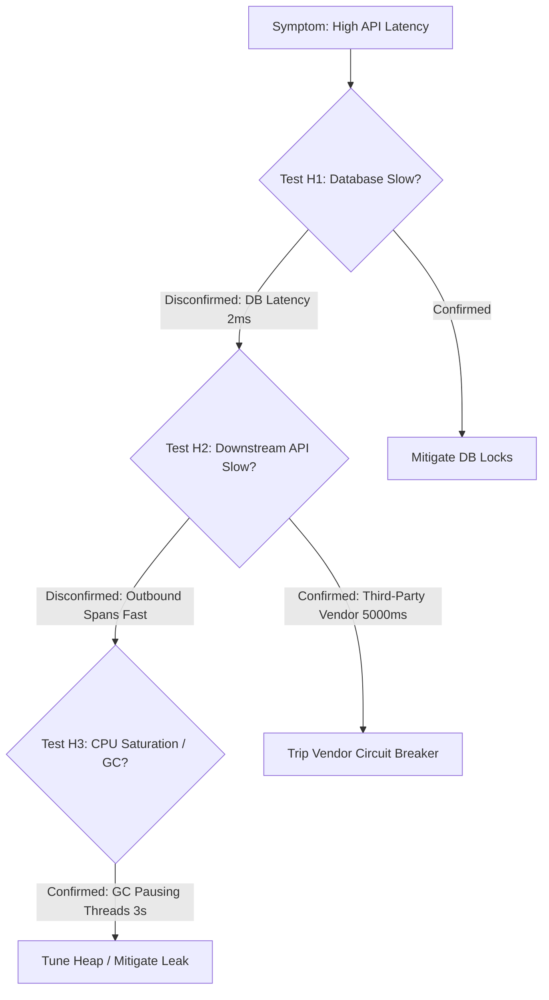

# 02. Hypothesis Elimination and Differential Diagnosis

## 1. Problem
Engineers frequently fall into **Confirmation Bias** during outages: they latch onto their first intuition (e.g. "It must be the database!") and spend an hour looking for evidence to support it while ignoring conflicting telemetry signals.

## 2. Production Context
Differential diagnosis is the systematic elimination of competing hypotheses through disconfirming evidence.

## 3. Mental Model: The Hypothesis Testing Matrix

| Competing Hypothesis | Telemetry Check (Non-Destructive) | Confirming Evidence | Disconfirming Evidence (ELIMINATED!) |
| :--- | :--- | :--- | :--- |
| **H1: Database Lock Contention** | Query `pg_stat_activity` / `pg_locks` | Queries in `waiting=true` state for $>5\text{s}$ | `pg_stat_activity` shows 0 waiting locks $\implies$ **H1 Rejected!** |
| **H2: Garbage Collection Pauses** | Query JVM GC metrics / GC log | Full GC pause duration $> 2000\text{ms}$ | Max GC pause $< 15\text{ms}$ $\implies$ **H2 Rejected!** |
| **H3: Downstream Vendor Slowdown** | Query OpenTelemetry outbound HTTP spans | Third-party vendor span duration $> 4500\text{ms}$ | Vendor spans average $25\text{ms}$ $\implies$ **H3 Rejected!** |
| **H4: Ingress Queue Saturated** | Inspect Tomcat/Jetty active thread count | Active threads $= \text{maxThreads}$ (200/200) | Active threads $= 12/200 \implies$ **H4 Rejected!** |

---

## 4. Differential Diagnosis Flowchart

---

## 5. Interview Questions & Model Answers

**Q1: How do you avoid confirmation bias when troubleshooting an outage under high pressure?**
**Answer**: I formulate at least three mutually exclusive, testable hypotheses before taking operational actions. For each hypothesis, I identify a specific metric or query that would **disprove** it. If the disconfirming evidence is found (e.g. database query latency is 2ms, disproving database slowdown), I immediately discard the hypothesis and move to the next candidate, preventing the team from wasting precious minutes chasing false leads.
