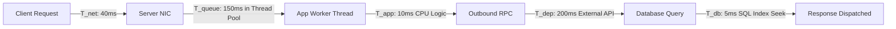

# 01. The Latency Decomposition Model

## 1. Problem
When a customer complains that "the application is slow," engineers often waste hours profiling Java code when the true delay is network transit RTT or queue wait time before processing ever starts.

## 2. Production Context
Latency is not a single atomic value: it is an aggregate stack of discrete physical and software delays.

## 3. Mental Model: The Latency Stack Formula
$$\mathbf{Total\ Latency} = \mathbf{T}_{\text{Network}} + \mathbf{T}_{\text{Queue}} + \mathbf{T}_{\text{AppCompute}} + \mathbf{T}_{\text{Dependency}} + \mathbf{T}_{\text{Database}}$$

---

## 4. Deconstructing Each Component

1. **$\mathbf{T}_{\text{Network}}$**: Speed-of-light propagation across fiber, DNS lookups, TCP handshakes, TLS negotiation, packet retransmissions.
2. **$\mathbf{T}_{\text{Queue}}$**: Time a request spends sitting idle in socket receive buffers, reverse proxy queues, or thread pool task queues waiting for an available worker thread. *(This explodes exponentially as utilization exceeds 80%)*.
3. **$\mathbf{T}_{\text{AppCompute}}$**: Actual CPU instruction execution: business logic, JSON parsing, regex evaluation.
4. **$\mathbf{T}_{\text{Dependency}}$**: Synchronous HTTP/gRPC calls made to downstream internal microservices or third-party vendors.
5. **$\mathbf{T}_{\text{Database}}$**: Network hop to DB, connection pool acquisition wait time, query execution time, lock acquisition wait, and result set deserialization.

---

## 5. Interview Questions & Model Answers

**Q1: How do you isolate whether high latency is caused by application compute time versus queue wait time?**
**Answer**: To distinguish compute time from queue wait time, I compare **Thread Execution Time** against **Total Ingress Request Time**. If OpenTelemetry distributed traces show the span begins 200ms after the HTTP request arrived at the reverse proxy, the request spent 200ms sitting idle in the thread pool queue ($\mathbf{T}_{\text{Queue}}$) before an available worker thread picked it up. In contrast, if the span starts immediately upon arrival and CPU profiling shows high active compute time inside business methods, the bottleneck is application compute ($\mathbf{T}_{\text{AppCompute}}$).
