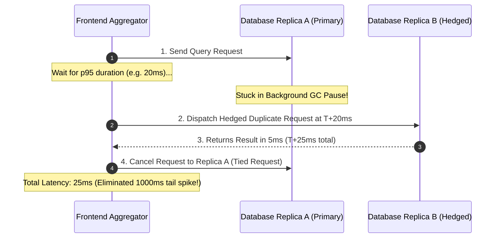

# 03. Tail Latency Amplification and Hedged Requests

## 1. Problem
In distributed search engines, recommendation systems, or sharded databases where a single frontend request fans out to 100 backend leaf nodes in parallel, the user-perceived latency is governed by the **slowest of the 100 nodes** (the 99th percentile of the leaf nodes).

## 2. Production Context
As architectures scale out horizontally, individual server tail outliers dominate overall user experience.

## 3. Mental Model: Fan-Out Tail Amplification Formula

If a request fans out to $N$ independent servers, each with a $99\%$ probability of responding in $<10\text{ms}$ (1% chance of a tail spike $>1000\text{ms}$):
$$\mathbf{P}(\text{User Request Hits Tail Spike}) = 1 - (1 - 0.01)^N$$

| Fan-Out Degree ($N$) | Probability User Experiences Tail Latency (>1s) |
| :-: | :-: |
| **1 Server** | $1.0\%$ |
| **10 Servers** | $1 - (0.99)^{10} = \mathbf{9.6\%}$ |
| **50 Servers** | $1 - (0.99)^{50} = \mathbf{39.5\%}$ |
| **100 Servers** | $1 - (0.99)^{100} = \mathbf{63.4\%}$ |
| **200 Servers** | $1 - (0.99)^{200} = \mathbf{86.6\%}$ |

*At $N=100$ fan-out, nearly 2 out of 3 user requests experience the 99th percentile outlier latency!*

---

## 4. Mitigation: Hedged Requests (Google Dean & Barroso Pattern)

Instead of waiting for a slow request to timeout, dispatch a duplicate request to a backup replica if the primary replica has not responded by the **95th percentile expected latency (e.g. after 20ms)**:

**Trade-off**: Hedged requests reduce p99.9 latency by $>80\%$ while increasing backend query load by only $\sim 5\%$ (since only $5\%$ of queries ever trigger a hedge).

---

## 5. Interview Questions & Model Answers

**Q1: How does tail latency amplification occur in fan-out microservices architectures?**
**Answer**: When an aggregator service fans out a request to $N$ downstream leaf nodes in parallel and must wait for all $N$ responses before returning the aggregated result to the client, the total response time is bounded by the slowest leaf node ($\max(T_1, T_2, \dots, T_N)$). Even if each individual leaf node has a 99% probability of fast execution ($1\%$ tail risk), the probability that at least one of the 100 nodes experiences a tail spike is $1 - (0.99)^{100} \approx 63.4\%$. Thus, tail latency becomes the common case rather than a rare anomaly.

**Q2: What is a "Hedged Request" and how does it differ from a standard retry?**
**Answer**: A standard retry is reactive: the client waits for the initial request to fail or timeout (e.g. after 5,000ms) before attempting a second request. A **Hedged Request** is proactive and speculative: if the initial request has not responded within the expected 95th percentile latency (e.g. 20ms), a duplicate request is immediately dispatched to an alternative replica while the first request is still in-flight. The client accepts whichever response arrives first and cancels the other, cutting tail latency with only a negligible $5\%$ increase in aggregate traffic.
