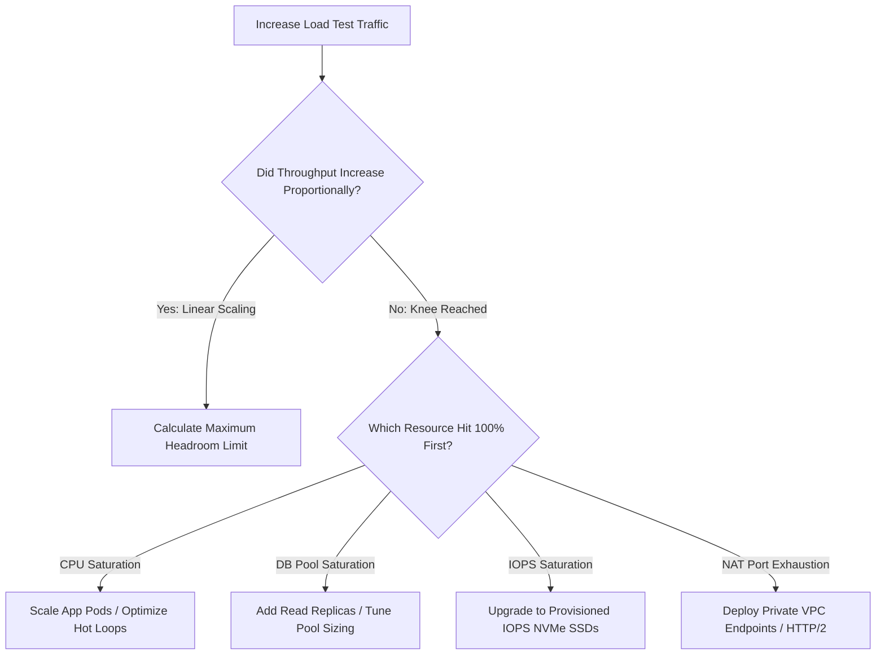

# 02. Per-Resource Saturation Profiling & Bottleneck Identification

## 1. Problem
A service fails to scale horizontally: adding 100 more application pods does not increase throughput by a single request because an unmonitored downstream resource (e.g. database connection pool or cloud NAT gateway port allocation) is completely saturated.

## 2. Production Context
A system's maximum throughput is strictly bounded by its **single narrowest bottleneck**.

## 3. Mental Model: The Per-Resource Bottleneck Matrix

| Resource Dimension | Saturation Metric | Hard Ceiling / Limit | Bottleneck Manifestation |
| :--- | :--- | :--- | :--- |
| **Compute (CPU)** | Linux CFS Quota Throttling | `container_cpu_cfs_throttled_periods_total` | High compute latency, slow JSON parsing |
| **Memory (RAM)** | Working Set vs cgroup limit | `container_memory_working_set_bytes` | Linux OOM Killer invocations (Exit 137) |
| **Disk Storage (IOPS)** | Device await / queue size | `r_await / w_await > 15ms`, `aqu-sz > 4` | Write operations stall in State D sleep |
| **Network Egress** | NIC bandwidth / packet drops | Cloud instance bandwidth caps (e.g. 10 Gbps) | TCP packet drops, socket timeout spikes |
| **NAT Gateway Ports** | Ephemeral port allocations | 64,000 concurrent sockets per destination IP | `EADDRNOTAVAIL` connection failures |
| **DB Connection Pool** | HikariCP active vs max | `active_connections == max_connections` | `ConnectionTimeoutException` after 30s |

---

## 4. Bottleneck Identification Flowchart

---

## 5. Interview Questions & Model Answers

**Q1: What is the difference between Resource Utilization and Resource Saturation?**
**Answer**: **Utilization** measures the fraction of time a resource is actively busy serving work over a time window (e.g. a CPU core at $70\%$ utilization or an 8GB memory allocation with 6GB used). **Saturation** measures the degree to which extra work cannot be served immediately and is forced to **wait in a queue** (e.g. CPU run queue depth $> 0$, memory pages swapping to disk, or database connection pool requests waiting for available connections). A system can be at 100% utilization without saturation if no extra work is queueing, but the moment saturation occurs, latency degrades exponentially.
