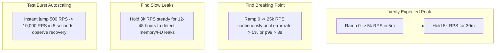

# 01. Load, Stress, Soak, and Spike Testing Archetypes

## 1. Problem
Teams run a 30-second load test from a single laptop against an endpoint, observe 200 OK responses, and claim the system can handle 10,000 RPS in production—only to have the database crash within 10 minutes of real customer traffic.

## 2. Production Context
Performance testing must answer distinct operational questions through specific testing methodologies.

## 3. Mental Model: The 4 Performance Testing Archetypes



---

## 4. Production k6 Script Example (Breakpoint & Soak Schedule)

```javascript
import http from 'k6/http';
import { check, sleep } from 'k6';

export const options = {
  stages: [
    { duration: '2m', target: 500 },   // Warmup phase
    { duration: '5m', target: 2000 },  // Standard load
    { duration: '5m', target: 5000 },  // Peak traffic
    { duration: '2m', target: 10000 }, // Stress breakpoint phase
    { duration: '3m', target: 0 },      // Ramp down
  ],
  thresholds: {
    'http_req_duration': ['p(95)<300', 'p(99)<1000'], // 95% < 300ms, 99% < 1s
    'http_req_failed': ['rate<0.01'],                 // Error rate < 1%
  },
};

export default function () {
  const res = http.get('http://api.example.com/v1/catalog', {
    headers: { 'Accept': 'application/json' },
  });
  check(res, {
    'status is 200': (r) => r.status === 200,
  });
  sleep(1); // Realistic user think time
}
```

---

## 5. Interview Questions & Model Answers

**Q1: What is the difference between a Stress Test and a Soak Test?**
**Answer**: A **Stress (or Breakpoint) Test** incrementally ramps traffic until the system fails or breaches latency thresholds, identifying the exact maximum throughput capacity, bottleneck component, and failure mode. A **Soak (or Endurance) Test** applies a steady, realistic load (e.g. 70% of peak) continuously over a long duration (12 to 48 hours) to uncover slow-manifesting defects that cannot be seen in short tests: memory leaks, native buffer accumulation, database connection leaks, and disk space/inode exhaustion.
