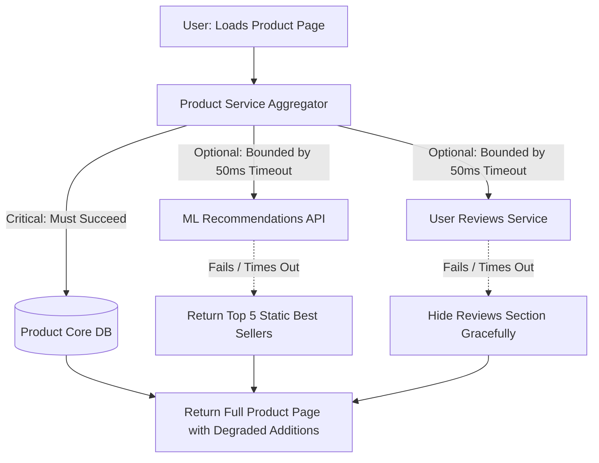

# 01. Critical vs. Optional Dependencies & Failure Propagation

## 1. Problem
An e-commerce checkout page crashes completely and returns HTTP 500 errors to 100% of customers because a non-essential "Recommended Products for You" machine learning microservice experienced a slow database lock.

## 2. Production Context
In distributed microservices, a single user journey often calls 10–30 internal and third-party dependencies. If all dependencies are treated as hard requirements, the overall availability of the service is the product of all dependencies' availabilities:
$$A_{\text{total}} = A_1 \times A_2 \times \dots \times A_{30}$$
*(If each service is $99.5\%$ available, $A_{\text{total}} = (0.995)^{30} \approx \mathbf{86.0\%}$ availability—over 100 hours of downtime a month!).*

## 3. Mental Model: Critical vs. Optional Classification

```
                           Dependency Classification
                                       │
        ┌──────────────────────────────┴──────────────────────────────┐
        ▼                                                             ▼
  Critical (Hard) Dependency                                  Optional (Soft) Dependency
  Core business transaction CANNOT proceed                    Service CAN continue with degraded
  without it (e.g. Payment Gateway, Inventory DB).            UX (e.g. Recommendations, Reviews, Avatar).
  Action on Failure: Return structured error.                 Action on Failure: Shed dependency / Fallback.
```

---

## 4. System Diagram: Resilient Fallback Boundary


---

## 5. Interview Questions & Model Answers

**Q1: How do you design an API to ensure that non-critical dependency outages never cause user-facing errors?**
**Answer**: I classify every downstream dependency during architectural design:
1. **Critical Dependencies** (e.g. Order Database): Wrap with strict timeouts, retry budgets, and fail-fast errors.
2. **Optional Dependencies** (e.g. Recommendations, Personalized Banners, Analytics): Wrap with **Circuit Breakers**, strict **Sub-100ms Timeouts**, and **Asynchronous Non-Blocking Execution** (e.g. CompletableFuture with fallback). If the optional service times out or fails, the circuit breaker immediately intercepts the failure and returns a static mock, cached payload, or empty list (`Optional.empty()`), allowing the core user transaction to complete with $100\%$ availability.
