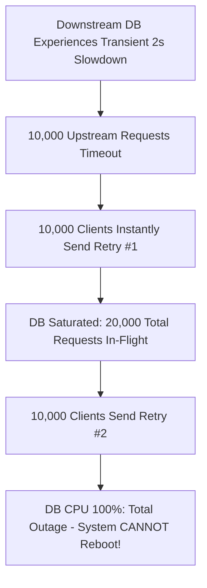

# 01. The Anatomy of a Retry Storm

## 1. Problem
A database experiences a transient 2-second lock contention hiccup. Upstream services retry failed queries 3 times immediately, multiplying inbound database traffic by **$400\%$**, pushing DB CPU to $100\%$, and transforming a 2-second glitch into a 4-hour global outage.

## 2. Production Context
Engineers often believe "retrying failed network calls improves availability." In reality, **unconstrained retries are an amplification attack against struggling downstream systems**.

## 3. Mental Model: Retry Load Amplification
If each service in a call chain retries failed requests $R = 3$ times:
$$\mathbf{Inbound\ Load\ Multiplier} = R^{\text{Call Chain Depth}}$$
- **Depth 1**: $1 \text{ original} + 3 \text{ retries} = \mathbf{4\times\ traffic}$.
- **Depth 2**: $4 \times 4 = \mathbf{16\times\ traffic}$.
- **Depth 3**: $4 \times 4 \times 4 = \mathbf{64\times\ traffic}$!

## 4. System Diagram

---

## 5. The Golden Rules of Production Retries
1. **Never Retry Non-Idempotent Writes** (e.g. raw HTTP POST without idempotency keys).
2. **Never Retry on Client Errors (4xx)** (Retrying a 400 Bad Request or 401 Unauthorized will never succeed).
3. **Never Retry Immediately Without Backoff & Jitter**.
4. **Never Retry Beyond the Retry Budget (Max 10% Retries)**.

---

## 6. Interview Questions & Model Answers

**Q1: Why do naive retries prevent an overloaded downstream service from ever recovering?**
**Answer**: When a service is overloaded, its queue depth is full and processing latency exceeds client timeouts. If clients retry immediately upon timing out, they inject new requests into the system faster than the service can clear its backlog. As a result, the service spends all its CPU cycles processing stale retries for requests whose clients have already disconnected, while newly arriving traffic continues piling up. The service enters a **livelock state** and cannot recover until upstream traffic is completely throttled or shed.
