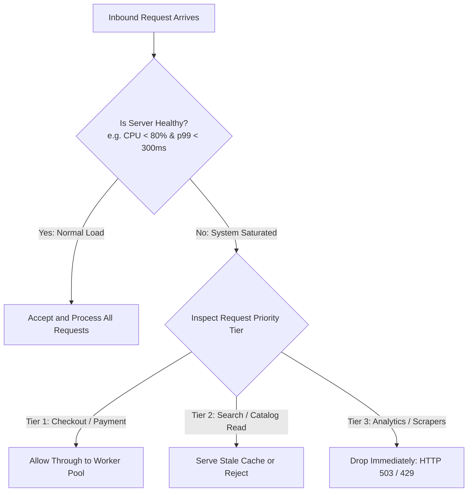

# 02. Adaptive Load Shedding and Admission Control

## 1. Problem
Under massive unexpected traffic surges, static rate limits fail: the system still accepts more traffic than its degraded database can handle, entering an unrecoverable latency death spiral where $100\%$ of requests timeout.

## 2. Production Context
**Adaptive Load Shedding** monitors real-time server health (p99 latency, CPU, queue depth) and automatically **rejects lower-priority inbound requests at the ingress gate** to ensure that critical traffic continues to succeed with sub-second latency.

## 3. Mental Model: Netflix Concurrency Limits / Gradient Algorithm
$$\mathbf{Gradient} = \frac{\text{RTT}_{\text{NoLoad}}}{\text{RTT}_{\text{Current}}}$$
$$\mathbf{New\ Concurrency\ Limit} = \mathbf{Current\ Limit} \times \mathbf{Gradient} + \mathbf{Headroom}$$
- If Current RTT exceeds baseline NoLoad RTT: **Gradient $< 1.0 \implies$ Concurrency limit dynamically shrinks (Load Shedding triggers)!**
- If Current RTT matches baseline: **Gradient $\ge 1.0 \implies$ Concurrency limit dynamically expands!**

---

## 4. Priority-Tiered Load Shedding Architecture

---

## 5. Interview Questions & Model Answers

**Q1: How does Adaptive Load Shedding differ from traditional static rate limiting?**
**Answer**: Traditional rate limiting enforces fixed static thresholds (e.g. 1,000 RPS per IP) based on pre-assumed system capacity, failing if capacity degrades (e.g. during a database failover where the server can only handle 200 RPS). **Adaptive Load Shedding** is dynamic and feedback-driven: it continuously measures real-time performance indicators (such as queue wait time, p99 latency gradient, or CPU pressure stall info). When performance begins to degrade, the admission controller automatically throttles or drops low-priority traffic at the door, preserving optimal throughput and sub-second latency for high-priority business transactions without requiring manual reconfiguration.
