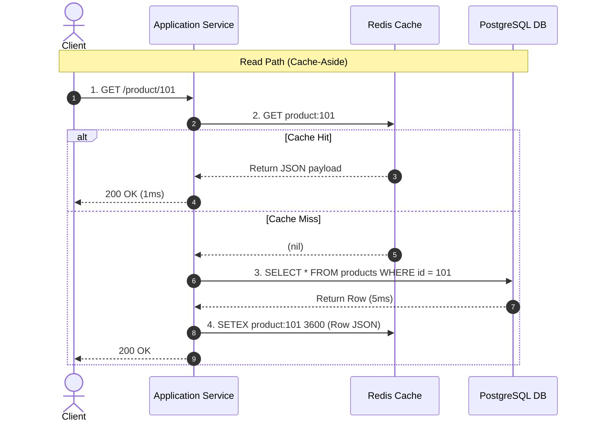

# 01. Cache-Aside, Invalidation, and the Dual-Write Problem

## 1. Problem
Updating database records and cache keys in separate steps introduces a **Dual-Write Race Condition**: under concurrent updates, the database and cache diverge permanently, serving stale or incorrect data indefinitely.

## 2. Production Context
Phil Karlton famously noted: *"There are only two hard things in Computer Science: cache invalidation and naming things."* In high-scale systems, caches must prioritize predictable invalidation over complex distributed two-phase commits.

## 3. Mental Model: Cache-Aside Read / Write Mechanics



---

## 4. The Dual-Write Race: Invalidate vs. Update

```
                        The Cache Invalidation Golden Rule
 ──────────────────────────────────────────────────────────────────────────────────────────
 ❌ Anti-Pattern: UPDATE database THEN UPDATE cache
    Race condition: Thread 1 updates DB → Thread 2 updates DB → Thread 2 updates Cache
    → Thread 1 updates Cache with stale data! (Cache permanently corrupted!).

 ✅ Production Pattern: UPDATE database THEN DELETE (EVICT) cache key!
    Next concurrent read will suffer a minor cache miss and re-populate the latest data.
```

---

## 5. Cache Avalanche & Penetration Defenses

| Failure Mode | Description | Production Defense |
| :--- | :--- | :--- |
| **Cache Avalanche** | Millions of keys set with identical 1-hour TTL expire at the exact same second, exposing DB to massive load spike. | **Add Jitter to TTL**: $\text{TTL} = \text{BaseTTL} + \text{random}(0, 300\text{s})$. |
| **Cache Penetration** | Attackers query millions of non-existent IDs (e.g. `id=-9999`), bypassing cache and hitting DB on every call. | **Bloom Filters** at edge + Cache Null Objects (`SETEX key 60s "NULL"`). |

---

## 6. Interview Questions & Model Answers

**Q1: Why should an application DELETE (evict) a cache key upon DB write rather than UPDATING the cache key?**
**Answer**: Updating the cache on write creates an unresolvable concurrency race condition. If Thread A and Thread B write to the database in that order, but network jitter causes Thread B's cache update to execute *before* Thread A's cache update, the cache will be overwritten with Thread A's older, stale value while the database contains Thread B's newer value. Deleting (evicting) the cache key upon database update guarantees that the next subsequent read will fetch the true latest database state and atomically re-populate the cache, avoiding stale data drift.
