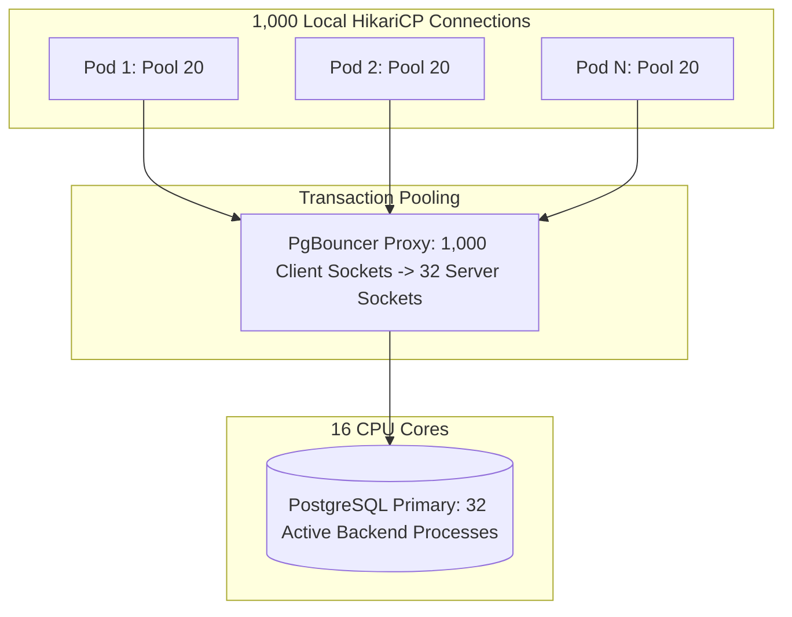

# 01. Database Connection Pool Sizing and Exhaustion

## 1. Problem
Under heavy load, engineers set application connection pools to 500 connections per pod across 20 pods (10,000 total connections). The database CPU spikes to $100\%$, throughput drops to zero, and the database crashes due to **OS Context Switching Thrashing**.

## 2. Production Context
In PostgreSQL, each client connection spawns a dedicated **OS backend worker process** consuming $\approx 10\text{MB}$ of RAM. When thousands of connections compete for 16 CPU cores, the kernel spends all CPU time performing context switches rather than executing queries.

## 3. Mental Model: The PostgreSQL Connection Pool Formula
$$\mathbf{Optimal\ Connections} = (\mathbf{CPU\ Cores} \times \mathbf{2}) + \mathbf{Effective\ Spindle\ Count}$$

### Example Calculation:
For a 16-core database server with fast NVMe SSD storage ($\text{Effective Spindle Count} = 1$):
$$\mathbf{Max\ Safe\ Connections} = (16 \times 2) + 1 = \mathbf{33\ Active\ Connections}$$
*A pool of 33 connections will deliver vastly higher throughput and lower p99 latency than a pool of 3,000 connections!*

---

## 4. Connection Pool Architecture: HikariCP + PgBouncer



---

## 5. Detecting Connection Leaks via `pg_stat_activity`

```sql
-- Find connections idle in transaction (Connection Leaks!)
SELECT pid, now() - xact_start AS duration, state, query
FROM pg_stat_activity
WHERE state = 'idle in transaction'
ORDER BY duration DESC;
```

---

## 6. Interview Questions & Model Answers

**Q1: Why does increasing the database connection pool size beyond (cores * 2) degrade database performance?**
**Answer**: In process-per-connection database architectures like PostgreSQL, each active connection requires its own operating system process, memory buffers, and scheduling slot. If 500 active queries attempt to execute on a 16-core CPU, the Linux kernel must continuously pre-empt running processes to give other connections a time slice, resulting in thousands of involuntary context switches, CPU cache invalidations, and lock contention on internal database shared memory structures. Reducing the active connection pool to match physical core capacity allows queries to execute without scheduling delays, maximizing disk and CPU saturation and increasing aggregate queries per second.

**Q2: What is the difference between Session Pooling and Transaction Pooling in PgBouncer?**
**Answer**: In **Session Pooling**, PgBouncer assigns a dedicated server connection to a client for the entire duration of the client's TCP connection lifetime, releasing it only when the client disconnects. In **Transaction Pooling**, PgBouncer assigns a server connection to a client **only for the duration of a single transaction** (`BEGIN ... COMMIT`); as soon as the transaction finishes, the server connection is immediately returned to the pool to serve another client, allowing thousands of application pods to multiplex over a tiny pool of 30 database connections.
