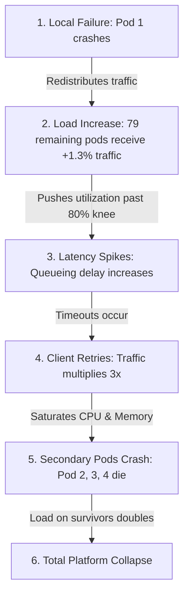

# 01. The Anatomy of a Cascading Failure and How to Break Every Link

## 1. Problem
A single pod in an 80-pod cluster runs out of memory and crashes. Instead of the remaining 79 pods absorbing the traffic, the entire cluster collapses sequentially within 90 seconds in a domino effect (**Cascading Failure**).

## 2. Production Context
Cascading failures occur when a local failure in one component increases the load on remaining healthy components, triggering secondary failures in a self-reinforcing positive feedback loop.

## 3. Mental Model: The 6-Link Cascading Chain

---

## 4. How to Break Every Link in the Chain

| Cascade Link | Vulnerability Mechanism | Production Circuit-Breaker / Mitigation |
| :--- | :--- | :--- |
| **Link 1 $\to$ 2** | Traffic shifts to fewer surviving nodes | **Autoscaling + Over-provisioned Headroom ($N+1$ / 40% buffer)** |
| **Link 2 $\to$ 3** | Queueing delay explodes near 80% utilization | **Adaptive Load Shedding** (Drop low-priority requests at ingress) |
| **Link 3 $\to$ 4** | Clients retry aggressively upon timeout | **Exponential Backoff with Full Jitter + Retry Budgets (Max 10%)** |
| **Link 4 $\to$ 5** | Threads block on slow downstream dependencies | **Circuit Breaker** (Fail-fast in $<0.1\text{ms}$ when open) |
| **Link 5 $\to$ 6** | Thundering herd hits cold restarting pods | **Startup Probes + Rate-Limited Traffic Warmup** |

---

## 5. Interview Questions & Model Answers

**Q1: What is a Cascading Failure, and what is the primary feedback mechanism that causes it?**
**Answer**: A Cascading Failure is a failure that broadens in scope over time due to positive feedback: an initial local failure (e.g. a node crash or slow database) increases the load on surviving components. The primary feedback mechanisms are:
1. **Load Redistribution**: Total inbound traffic remains constant while healthy capacity shrinks, pushing survivors past their saturation knee.
2. **Retry Amplification**: Clients timing out issue immediate retries, multiplying traffic volume by $3\times - 5\times$.
3. **Queueing Latency**: Processing queues fill, causing threads to block and memory footprints to grow, triggering secondary OOM kills until the entire cluster is dead.

**Q2: If an entire microservice fleet is trapped in a cascading crash loop, what is the fastest operational recovery procedure?**
**Answer**:
1. **Cut Off Inbound Traffic at the Edge**: Throttle or block external traffic at the API Gateway / Load Balancer (or shed 80% of traffic).
2. **Restart the Downstream Fleet Cleanly**: Allow database and service pods to boot up in an isolated environment with zero incoming load.
3. **Warm Caches and Connection Pools**: Verify all pods pass readiness probes.
4. **Gradually Ramp Ingress Traffic**: Slowly restore traffic in increments ($10\% \to 25\% \to 50\% \to 100\%$) over 5–10 minutes to prevent a thundering herd.
