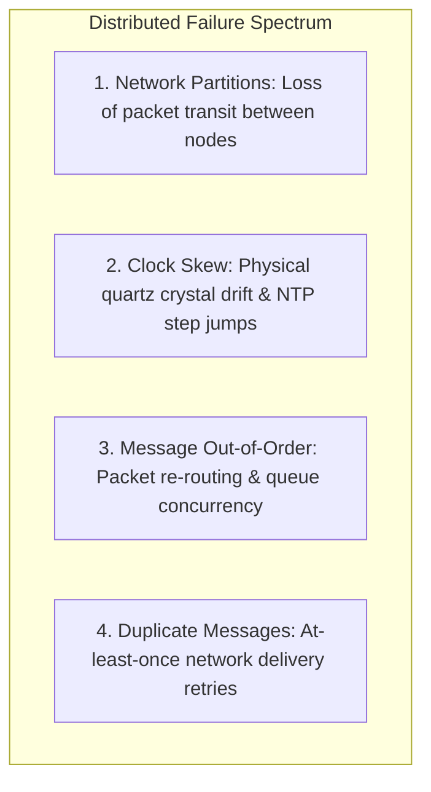

# 02. Network Partitions, Clock Skew, and Message Ordering

## 1. Problem
Two servers in a distributed cluster use `System.currentTimeMillis()` to order financial balance updates. Due to **NTP Clock Drift (Clock Skew)**, Server B's wall clock is 150ms behind Server A, causing newer transactions to be overwritten by older transactions in a Last-Write-Wins (LWW) conflict resolution policy.

## 2. Production Context
In distributed systems, physical wall clocks can never be perfectly synchronized across network nodes. Production engineers must rely on logical clocks or bounded uncertainty intervals.

## 3. Mental Model: The Distributed Failure Spectrum



---

## 4. Mitigating Distributed Time & Ordering Anomalies

| Distributed Anomaly | Why It Happens | Production Engineering Solution |
| :--- | :--- | :--- |
| **Clock Skew / NTP Jump** | Physical crystal drift, leap seconds, VM hypervisor pauses | **Logical Clocks (Lamport / Vector Clocks)** or Google Spanner **TrueTime** ($[\text{earliest}, \text{latest}]$ uncertainty bounds). |
| **Duplicate Message Delivery** | Network retry after unacknowledged success in Kafka | **Idempotency Keys**: Store `idempotency_key` in a unique DB index; reject duplicates. |
| **Out-of-Order Message Processing** | Partition rebalancing / concurrent worker threads | **Partition Key Hashing**: Route all events for the same `entity_id` to the exact same Kafka partition. |

---

## 5. Idempotent Consumer Pattern (SQL DDL)

```sql
CREATE TABLE processed_events (
    idempotency_key VARCHAR(64) PRIMARY KEY,
    entity_id VARCHAR(64) NOT NULL,
    processed_at TIMESTAMPTZ NOT NULL DEFAULT NOW()
);

-- Safe Idempotent Insertion inside Transaction
INSERT INTO processed_events (idempotency_key, entity_id)
VALUES ('evt_req_99214_charge', 'usr_102')
ON CONFLICT (idempotency_key) DO NOTHING;
-- If 0 rows inserted: Skip processing! Duplicate detected!
```

---

## 6. Interview Questions & Model Answers

**Q1: Why is relying on `System.currentTimeMillis()` or physical wall clocks dangerous for event ordering in distributed databases?**
**Answer**: Physical clocks on different hardware servers drift due to thermal fluctuations, quartz crystal imperfections, and virtualization hypervisor pauses. Even with Network Time Protocol (NTP) synchronization, clock skew between servers routinely ranges from 10ms to hundreds of milliseconds. Furthermore, NTP can step the clock backwards during corrections. If a distributed database uses Last-Write-Wins (LWW) based on physical timestamps, a write executed at 12:00:01.100 on a slow clock will be permanently overwritten by an older write executed at 12:00:01.050 on a fast clock, resulting in silent data loss. Production systems use **Lamport Timestamps, Raft Log Indices, or Google TrueTime** to enforce strict causality.

**Q2: What is the difference between At-Least-Once delivery and Exactly-Once processing in distributed message queues?**
**Answer**: In distributed networks where acknowledgments can be lost over the wire, message brokers (like Kafka or RabbitMQ) provide **At-Least-Once delivery**: if an acknowledgment is lost, the broker retransmits the message. Achieving **Exactly-Once Processing semantics** requires application-level collaboration: the consumer must be designed as an **Idempotent Consumer**, checking a unique transaction/idempotency key against a persistent store within an atomic database transaction before executing side effects, ensuring duplicate messages produce zero duplicate state changes.
