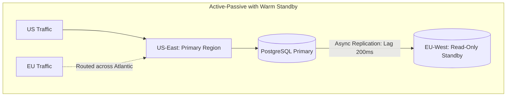
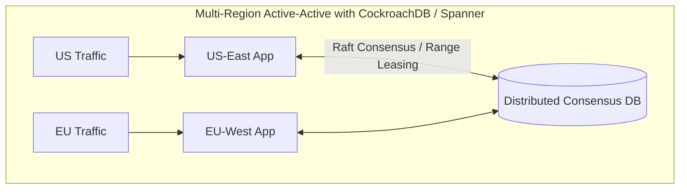

# 02. Multi-Region Active-Active vs. Active-Passive Architectures

## 1. Problem
An organization attempts to deploy an **Active-Active Multi-Region** database across US-East and EU-West without addressing cross-region replication lag, resulting in write-write conflicts, duplicate primary keys, and data corruption.

## 2. Production Context
Deploying across multiple geographic cloud regions provides the highest disaster recovery resilience, but introduces speed-of-light cross-region latency ($70\text{ms} - 120\text{ms}$ RTT).

## 3. Mental Model: Active-Active vs. Active-Passive Comparison

---

## 4. Multi-Region Architecture Trade-offs Matrix

| Dimension | Active-Passive (Failover) | Active-Active (Read-Anywhere / Write-Local) |
| :--- | :--- | :--- |
| **Complexity** | Moderate (Standard asynchronous replication) | High (Requires Raft consensus or Conflict-Free Replicated Data Types / CRDTs) |
| **Write Latency** | Low ($2-5\text{ms}$ local writes) | High ($80-120\text{ms}$ cross-region consensus round-trip) |
| **Failover RTO** | $2 - 5\text{ minutes}$ (Promote replica + DNS flip) | **$< 1\text{ second}$ (Automatic)** |
| **Split-Brain Risk** | High during automated failover if un-fenced | Zero (Enforced by Raft quorum consensus) |

---

## 5. Interview Questions & Model Answers

**Q1: What are the primary engineering challenges of implementing an Active-Active Multi-Region architecture?**
**Answer**:
1. **Speed-of-Light Cross-Region Latency**: Synchronous consensus (Raft/Paxos) across continents adds $70\text{ms}-150\text{ms}$ per write transaction.
2. **Concurrent Write-Write Conflicts**: Asynchronous multi-master databases (e.g. Cassandra / DynamoDB Global Tables) suffer from concurrent updates to the same record; resolving conflicts requires Last-Write-Wins (which loses data) or CRDTs.
3. **Cross-Region Data Egress Costs**: Continuous bi-directional replication of petabytes of state across cloud regions generates massive data transfer invoices.
4. **Data Sovereignty & Compliance (GDPR)**: Regulations often legally prohibit storing or replicating European user PII in US datacenters.
