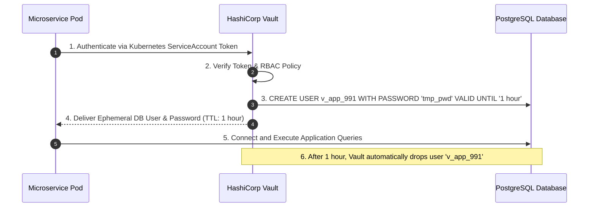

# 01. Dynamic Secrets Management and Automated Certificate Rotation

## 1. Problem
Hardcoding static database passwords and API keys in environment variables or configuration files means credentials are never rotated, remain vulnerable to leaks in log files, and require full service redeployments to update.

## 2. Production Context
Production systems enforce **Zero-Trust**: secrets should be short-lived, dynamically generated on-demand, and automatically rotated without service restarts.

## 3. Mental Model: Short-Lived Dynamic Credentials

---

## 4. Automated TLS Certificate Rotation with `cert-manager`
$$\mathbf{ACME\ DNS\text{-}01\ Challenge} \longrightarrow \mathbf{Let's\ Encrypt\ Signs\ Cert} \longrightarrow \mathbf{cert\text{-}manager\ Updates\ Secret} \longrightarrow \mathbf{Ingress\ Hot\ Reload}$$
- Certificates are renewed automatically at **60 days (30 days before 90-day expiry)**.
- Proxies (Envoy / NGINX) use dynamic filesystem watchers (or SDS - Secret Discovery Service) to hot-reload certificates without dropping existing TLS connections.

---

## 5. Interview Questions & Model Answers

**Q1: What are Dynamic Secrets, and why are they superior to static encrypted secrets in Vault/K8s Secrets?**
**Answer**: Dynamic Secrets are credentials generated on-demand by a secrets engine (like HashiCorp Vault) specifically for a single client when requested, with an associated short Time-To-Live (e.g. 1 hour). Unlike static secrets—which exist indefinitely and must be manually updated across multiple systems when rotated—dynamic secrets are automatically created with unique usernames/passwords in the downstream database and revoked immediately upon TTL expiration. If a dynamic credential is leaked or logged, its blast radius is strictly bounded in time and can be revoked instantly without breaking any other running service instances.
