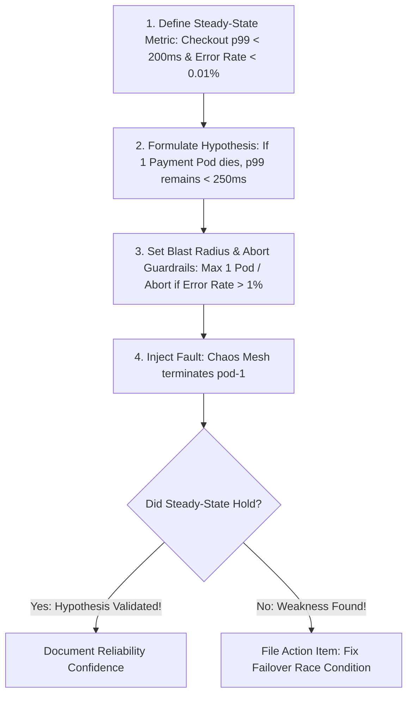

# 01. Principles of Chaos Engineering & Production GameDays

## 1. Problem
Engineers assume their circuit breakers and auto-scalers will work during an outage, but when a real datacenter fiber cut occurs, untested fallback configurations fail, causing total downtime.

## 2. Production Context
Chaos Engineering is **the discipline of experimenting on a system in order to build confidence in the system's capability to withstand turbulent conditions in production**.

## 3. Mental Model: The 5 Phases of a Chaos Experiment

---

## 4. Running a Production GameDay (Wheel of Misfortune)

A GameDay is a structured simulation where an SRE "Chaos Master" secretly injects a synthetic fault into a staging or canary production environment while the on-call team responds in real time:

### GameDay Execution Cadence:
1. **Briefing (10m)**: Establish safety observer with emergency abort permissions.
2. **Execution (45m)**: Inject fault (e.g. inject 300ms latency to primary DB).
3. **Observation (30m)**: Evaluate team's MTTD (detection time), MTTM (mitigation time), and runbook accuracy.
4. **Debrief (20m)**: Document gaps in monitoring and refine alert thresholds.

---

## 5. Interview Questions & Model Answers

**Q1: What distinguishes Chaos Engineering from traditional QA testing?**
**Answer**: Traditional QA testing validates that software meets functional specifications under predictable inputs (**Deterministic Correctness**: *"Given input X, does the function return Y?"*). Chaos Engineering tests the **systemic resilience and emergent behavior** of complex distributed infrastructure under unpredictable, turbulent operating conditions (**Empirical Resilience**: *"When network latency increases by 500ms on 20% of nodes, does the system gracefully degrade or enter an unrecoverable cascading failure?"*). It aims to uncover unknown architectural vulnerabilities before they manifest as real production outages.
