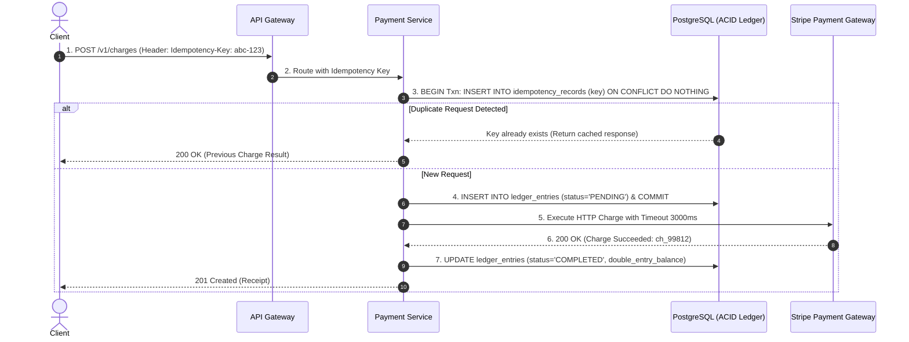

# 02. Production System Design: Mission-Critical Payment Service

## 1. System Requirements & Functional Scope
- **Functional**: Process credit card payments, maintain immutable double-entry ledger balances, integrate with third-party payment gateways (Stripe/Adyen), and handle asynchronous webhooks.
- **Availability Target**: $99.999\%$ ("Five 9s") for read balance queries; $99.99\%$ for write charge requests.
- **Strict Invariant**: **Zero Double Charging & Zero Silent Data Corruption** (Linearizable Correctness prioritized over raw throughput).

---

## 2. Traffic & Latency Budgets
- **Peak Write Traffic**: $5,000\text{ Charges Per Second}$.
- **Peak Read Traffic**: $20,000\text{ Balance Inquiries Per Second}$.
- **Latency SLO**: $p99 \le 2,000\text{ms}$ (dominated by external payment gateway network transit).

---

## 3. Capacity & Storage Sizing
- **PostgreSQL Database Storage**: 100 million transactions per month $\times 1.5\text{KB per ledger entry} = \mathbf{150\text{GB/month}}$.
- **Database Partitioning**: Declarative range partitioning by `transaction_month` with automatic sub-table provisioning.
- **Connection Pool**: PgBouncer transaction pooling managing 30 active primary connections over 16-core Aurora PostgreSQL cluster.

---

## 4. Architecture & Double-Entry Ledger Diagram

---

## 5. Resilience & Failure Handling
- **Gateway Timeout / Network Partition on External Vendor**: If Stripe takes $>3,000\text{ms}$ or returns a 500 error:
  - Do **NOT** assume the transaction failed!
  - Payment Service marks transaction as `REQUIRES_RECONCILIATION`.
  - Asynchronous background worker queries Stripe's `/charges?idempotency_key=abc-123` endpoint to confirm charge state before debiting customer ledger.
- **Circuit Breakers**: Resilience4j circuit breaker trips to `OPEN` if Stripe error rate exceeds $40\%$, failing-fast and queuing non-urgent charges for batch processing.

---

## 6. Security, Compliance & Auditing
- **PCI-DSS Compliance**: Zero raw credit card PANs touch application servers; client uses Stripe Elements to generate ephemeral client tokens.
- **HMAC Webhook Signatures**: All incoming webhook notifications validated with SHA-256 HMAC cryptographic signatures before processing.

---

## 7. Trade-offs & Production Defense
- **Correctness vs Latency**: We enforce strict database transaction commits before and after external RPC calls, accepting higher latency to guarantee that double-spending or duplicate charges are mathematically impossible.
