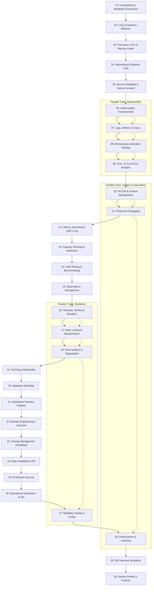

# Production Engineering Learning Dependency Graph

This document defines the strict pedagogical progression from system foundations to advanced distributed resilience and Staff-level production architecture.

---

## 🗺️ Master Prerequisite Dependency Graph

---

## 📌 Module Prerequisite Guide

| Module | Hard Prerequisites | Unlocks |
| :--- | :--- | :--- |
| **01–05: Systems Foundations** | Basic Linux/programming knowledge | Observability, Networking, Debugging |
| **06–10: Observability & Incidents** | Modules 01–05 | Production Debugging, SLO Error Budgets |
| **11–14: Performance & Capacity** | Modules 02, 03, 07 | Load Testing, Capacity Forecasting |
| **15–21: Resilience & Distributed Systems** | Modules 04, 05, 12 | Release Safety, Chaos Engineering |
| **22–28: Operations & Security** | Modules 10, 16, 21 | DR Failover, Automated Self-Healing |
| **29–30: Interview Mastery & Projects** | Modules 01–28 | Senior & Staff Hiring Loops |
