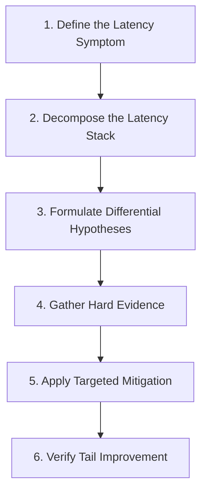

# Production Performance Debugging Guide

A repeatable, evidence-driven methodology for diagnosing high latency, CPU saturation, memory leaks, and I/O bottlenecks.

---

## 🔍 The 6-Step Triage Protocol



---

## 🛠️ The Production Debugging Toolkit

### 1. Latency Decomposition Formula
$$\text{Total Latency} = \text{Network Hop} + \text{Queue Wait} + \text{CPU Execution} + \text{Downstream RPC} + \text{Database I/O}$$

### 2. Linux First-Response Diagnostic Commands
```bash
# 1. Inspect system load, CPU, and running processes
top -b -n 1 | head -n 20

# 2. Check memory, buffers, and swap activity
free -m

# 3. Check disk I/O saturation and queue depth
iostat -xz 1 3

# 4. Check socket states and connection queues
ss -s

# 5. Check Linux Pressure Stall Information (PSI)
cat /proc/pressure/cpu
cat /proc/pressure/memory
cat /proc/pressure/io
```
