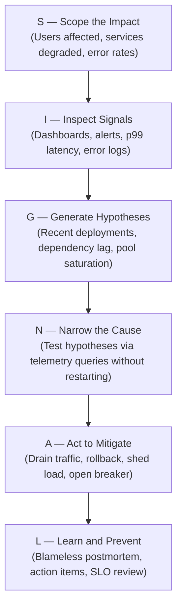
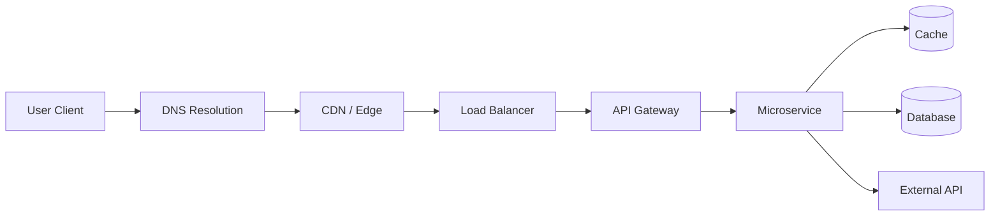

# Production Engineering Master Frameworks

The definitive mental models, incident protocols, and architectural checklists governing production reliability, debugging, and system design.

---

## 1. The 11 Reliability Dimensions

When analyzing or designing any production system, evaluate these eleven dimensions. Never optimize one silently at the expense of another — explicitly name the trade-off.

```
       ┌─────────────────────────────────────────────────────────────┐
       │                 11 Reliability Dimensions                   │
       └──────────────────────────────┬──────────────────────────────┘
                                      │
 ┌───────────────┬────────────────────┼────────────────────┬───────────────┐
 ▼               ▼                    ▼                    ▼               ▼
Availability    Latency          Throughput           Correctness     Durability
Uptime & SLOs   p50/p95/p99 tails RPS & concurrency   Zero data drift Zero data loss
                                                           
 ┌───────────────┬────────────────────┼────────────────────┬───────────────┐
 ▼               ▼                    ▼                    ▼               ▼
Capacity        Reliability      Recoverability       Operability     Security & Cost
Headroom & knees Mean time between MTTR & DR failover  Runbooks & toil Auth, certs, ROI
```

---

## 2. The SIGNAL Incident Triage Protocol

A disciplined, non-destructive methodology for managing active production outages:



---

## 3. The 11-Point Production System Design Checklist

Every system design must be evaluated against all eleven stages:

1. **Requirements**: Functional user journeys, non-functional SLAs, availability target (e.g. 99.95%).
2. **Traffic**: Peak read/write QPS, request size, payload compression, seasonal spikes.
3. **Latency**: p50, p95, and p99 latency budgets per internal hop and client boundary.
4. **Capacity**: Compute cores, RAM, I/O bandwidth, database connection pool headroom.
5. **Dependencies**: Critical vs optional services, failure domain boundaries, third-party timeouts.
6. **Observability**: Metrics (RED/USE), structured logs with trace correlation, distributed tracing.
7. **Reliability**: Redundancy, multi-AZ deployment, health probes, graceful shutdown hooks.
8. **Failure Modes**: Network partitions, thread starvation, OOM kills, cascading retries.
9. **Security**: Secret management, mTLS encryption, least privilege RBAC, rate limits.
10. **Recovery**: Automated rollback triggers, backup/restore RPO/RTO, disaster recovery drills.
11. **Trade-offs**: Strong consistency vs high availability, memory cost vs CPU overhead.

---

## 4. The Request-to-Incident Path

For every hop in the execution flow, identify failure modes, observability signals, and recovery actions:


