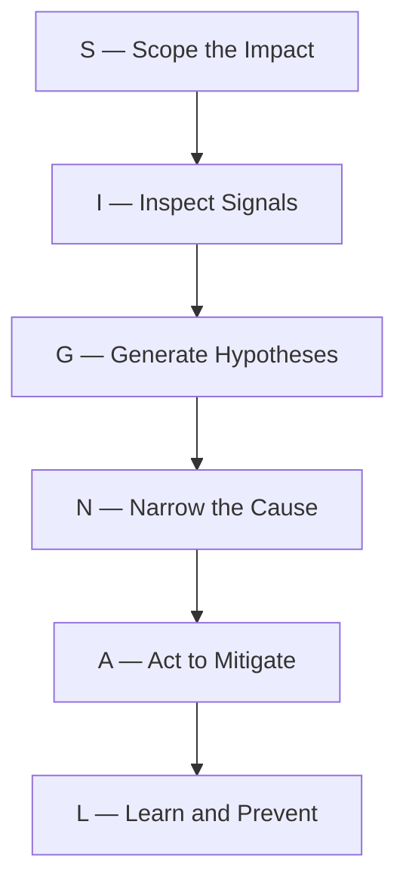

# Production Engineering Interview Preparation

> **Deep, implementation-first Production Engineering & Site Reliability Engineering (SRE) interview preparation curriculum for SDE2, Senior, and Staff-level engineering roles.**

---

## 🎯 Mission & Skill Arc

This repository teaches experienced software and backend engineers how to keep large-scale distributed systems **reliable, observable, performant, scalable, recoverable, and operable in production**.

$$\mathbf{UNDERSTAND} \to \mathbf{OBSERVE} \to \mathbf{MEASURE} \to \mathbf{DETECT} \to \mathbf{DEBUG} \to \mathbf{MITIGATE} \to \mathbf{RECOVER} \to \mathbf{AUTOMATE} \to \mathbf{OPTIMIZE} \to \mathbf{DESIGN} \to \mathbf{DEFEND}$$

---

## 🏛️ Core Mental Models & Frameworks

### 1. The SIGNAL Incident Triage Protocol

### 2. The 11-Point Production System Design Checklist
$$\text{Requirements} \to \text{Traffic} \to \text{Latency} \to \text{Capacity} \to \text{Dependencies} \to \text{Observability} \to \text{Reliability} \to \text{Failure Modes} \to \text{Security} \to \text{Recovery} \to \mathbf{Trade\text{-}offs}$$

### 3. The End-to-End Request-to-Incident Path
$$\text{User} \to \text{DNS} \to \text{Load Balancer} \to \text{Service} \to \text{Application} \to \text{Cache} \to \text{Database} \to \text{External Dependencies}$$

---

## 📚 30-Module Curriculum Overview

| # | Module Name | Core Focus & Production Topics |
| :-: | :--- | :--- |
| **01** | [Foundations](01-production-engineering-foundations/) | PE vs SRE vs DevOps vs Platform, Reliability dimensions & trade-offs |
| **02** | [Linux & System Behavior](02-linux-and-system-behavior/) | `/proc`, load average, PSI, CPU/Memory/Disk/FD triage via Linux tools |
| **03** | [Processes, Memory & CPU](03-processes-memory-and-cpu/) | OOM-killer, memory leaks, GC pressure, thread pool & FD exhaustion |
| **04** | [Networking & Request Path](04-networking-and-request-path/) | DNS, TCP, TLS, HTTP, load balancers, proxies, timeouts, packet loss |
| **05** | [Service Reliability](05-service-reliability/) | Failure domains, liveness vs readiness, graceful shutdown, blast radius |
| **06** | [Observability Fundamentals](06-observability-fundamentals/) | Observability vs monitoring, telemetry pillars, high cardinality |
| **07** | [Logs, Metrics & Traces](07-logs-metrics-and-traces/) | Structured logging, OpenTelemetry tracing, histograms, p95/p99 vs averages |
| **08** | [Monitoring & Alerting](08-monitoring-and-alerting/) | Actionable alerting, alert fatigue, symptom vs cause-based alerts |
| **09** | [SLI, SLO, SLA & Error Budgets](09-sli-slo-sla-and-error-budgets/) | Defining SLIs, deriving SLOs from user pain, error budget policies |
| **10** | [On-Call & Incident Response](10-on-call-and-incident-response/) | Incident Commander, communication cadence, severity levels, triage discipline |
| **11** | [Production Debugging](11-production-debugging/) | Evidence-driven debugging methodology, hypothesis elimination, root cause |
| **12** | [Latency & Performance](12-latency-and-performance/) | Latency decomposition, queueing theory, Little's Law, tail latency |
| **13** | [Capacity Planning](13-capacity-planning/) | Resource demand forecasting, saturation points, headroom calculation |
| **14** | [Load Testing & Benchmarking](14-load-testing-and-benchmarking/) | Stress/soak/spike testing, saturation discovery, honest benchmarking |
| **15** | [Dependency Management](15-dependency-management/) | Critical vs optional deps, blast radius containment, failure propagation |
| **16** | [Timeouts, Retries & Circuit Breakers](16-timeouts-retries-and-circuit-breakers/) | Backoff + jitter, retry budgets, preventing retry storms, breaker states |
| **17** | [Rate Limiting & Backpressure](17-rate-limiting-and-backpressure/) | Token/leaky bucket, concurrency limits, load shedding, admission control |
| **18** | [Graceful Degradation & Fault Isolation](18-graceful-degradation-and-fault-isolation/) | Fallbacks, bulkheads, dependency shedding, dangerous fallbacks |
| **19** | [Caching & Performance](19-caching-and-performance/) | Cache-aside, stampedes, TTLs, invalidation, consistency vs availability |
| **20** | [Database Reliability](20-database-reliability/) | Connection exhaustion, lock contention, replication lag, pool sizing |
| **21** | [Distributed Systems Failures](21-distributed-systems-failures/) | Partitions, clock skew, split-brain, cascading failure containment |
| **22** | [Release Engineering](22-release-engineering/) | Deployment risks, canary rollouts, feature flags, deployment verification |
| **23** | [Change Management & Rollback](23-change-management-and-rollback/) | Rollback vs forward fix, safe migration compatibility, blast radius reduction |
| **24** | [High Availability & DR](24-high-availability-and-disaster-recovery/) | Multi-region, failover, RPO, RTO, active-active vs active-passive |
| **25** | [Production Security](25-production-security/) | Secret rotation, cert expiration, least privilege, security incidents |
| **26** | [Operational Automation & Toil](26-operational-automation-and-toil/) | Toil measurement, self-healing systems, safe remediation automation |
| **27** | [Reliability Testing & Chaos](27-reliability-testing-and-chaos/) | Chaos engineering, controlled failure injection, guardrails & abort rules |
| **28** | [Postmortems & Learning](28-postmortems-and-learning/) | Blameless postmortem culture, timeline reconstruction, systemic fixes |
| **29** | [Interview Question Bank](29-production-engineering-interview-questions/) | 500 categorized SDE2/Senior/Staff technical interview questions |
| **30** | [System Design & Projects](30-production-system-design-and-projects/) | 5 reference production system designs & 8 production projects |

---

## 📖 Supporting Resources

- [CURRICULUM.md](CURRICULUM.md) — Comprehensive curriculum syllabus and learning outcomes
- [ROADMAP.md](ROADMAP.md) — 6-week intensive study roadmap
- [STATE.md](STATE.md) — Repository development tracking and phase completion state
- [CHANGELOG.md](CHANGELOG.md) — Version history and prompt changelog
- [REFERENCES.md](REFERENCES.md) — Sibling repository linkages (Java, Spring Boot, SQL, Cloud, K8s)
- [VERSION_MATRIX.md](VERSION_MATRIX.md) — Verified tool versions and assumptions
- [COVERAGE_MATRIX.md](COVERAGE_MATRIX.md) — Complete concept-by-concept verification matrix
- [DEPENDENCY_GRAPH.md](DEPENDENCY_GRAPH.md) — Prerequisite learning dependency graph
- [INCIDENT_SCENARIOS.md](INCIDENT_SCENARIOS.md) — 50+ real-world production incident scenarios
- [PRODUCTION_RUNBOOKS.md](PRODUCTION_RUNBOOKS.md) — Production incident response runbooks
- [LABS.md](LABS.md) — Hands-on local failure injection labs catalog
