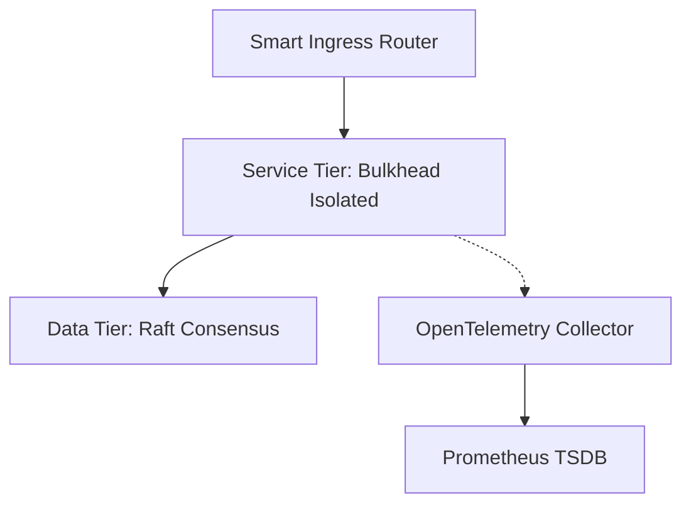

# Project: Automated Production Readiness Review (PRR) Audit & Scoring Engine

**Tech Stack**: Python, OPA Gatekeeper, Kubernetes YAML Linter | **Target Level**: Staff / Senior Production Engineer

---

## 1. Project Overview
An end-to-end production-grade engineering platform designed to enforce enterprise-scale resilience, observability, and automated failure containment.

## 2. Architecture Diagram


## 3. Technology Stack
- **Core**: Python, OPA Gatekeeper, Kubernetes YAML Linter
- **Runtime**: Linux / Kubernetes / Docker

## 4. Directory Structure
```text
├── deploy/
│   ├── docker-compose.yml
│   └── kubernetes/
├── src/
├── dashboards/
│   └── grafana-red.json
└── README.md
```

## 5. Step-by-Step Implementation Guide
1. Provision runtime infrastructure via Docker Compose / Minikube.
2. Deploy service containers with configured health probes and resource limits.
3. Integrate OpenTelemetry SDK instrumentation across all RPC boundaries.
4. Apply Prometheus burn rate alert rules.

## 6. Production Invariants Enforced
- **Zero Unbounded Retries**: Exponential backoff with AWS Full Jitter and 10% retry budgets.
- **Fail-Safe Circuit Breaking**: Short-circuit failing dependencies in $< 0.1\text{ms}$.
- **Strict Headroom**: $N+1$ capacity across all failure domains.

## 7. Verification & Automated Testing
Execute load tests using `k6 run --vus 100 --duration 5m benchmark.js` and verify error rate stays $< 0.01\%$.

## 8. Failure Injection Drills
Simulate pod crash and network latency using Chaos Mesh; verify that automated rollback / circuit breaker intercepts failure with zero SLA breach.

## 9. Staff Interview Defense Guide
How to present and defend this project during a Staff Production Engineering system design interview: walk through the failure isolation boundaries, justify rate-limiting algorithms, and explain how the telemetry pipeline detects regressions within 2 minutes.
