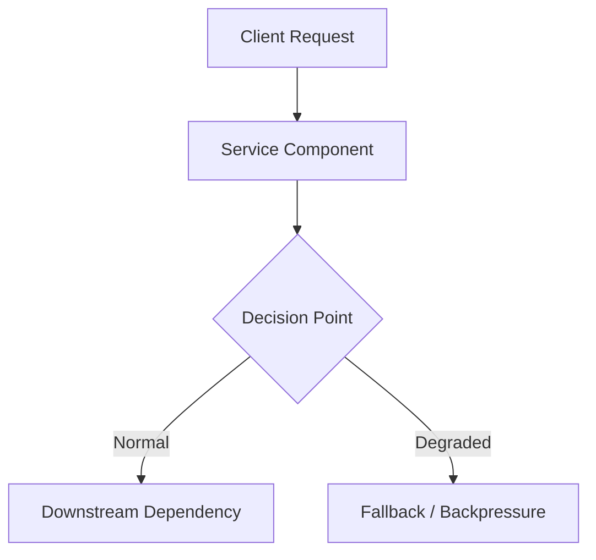

# Lesson Template

## 1. Problem
[Describe the production reliability or performance problem this lesson addresses.]

## 2. Production Context
[Explain where and why this occurs in real production architectures at scale.]

## 3. Mental Model
[Core concepts, state transitions, and theoretical foundations.]

## 4. System Diagram

## 5. Signals
[Key metrics, logs, traces, and indicators that manifest during this state.]

## 6. Failure Modes
[Specific ways this component or pattern fails under stress.]

## 7. Detection
[Alert rules, PromQL queries, log signatures, or anomaly patterns.]

## 8. Diagnosis
[Step-by-step triage sequence to isolate the root cause.]

## 9. Mitigation
[Immediate operational steps to reduce blast radius and restore service.]

## 10. Recovery
[Steps to return the system to standard operating state.]

## 11. Verification
[Checks and telemetry queries to confirm normal operation is restored.]

## 12. Prevention
[Architectural, configuration, and guardrail changes to prevent recurrence.]

## 13. Automation
[Self-healing scripts, alert routing, or auto-remediation workflows.]

## 14. Performance
[Latency, throughput, and resource utilization implications.]

## 15. Reliability
[Availability, durability, and resilience impact.]

## 16. Trade-offs
[Comparison of design choices and architectural trade-offs.]

## 17. Production Example
[A concrete, realistic scenario demonstrating this concept in action.]

## 18. Interview Questions
- **Q1**: [Senior/Staff level question]
- **Q2**: [Senior/Staff level question]
- **Q3**: [Senior/Staff level question]

## 19. Strong Interview Answer
[Model answer demonstrating deep production engineering expertise.]

## 20. Hands-on Exercise
[Safe, local exercise with setup, observation, failure injection, and cleanup.]
